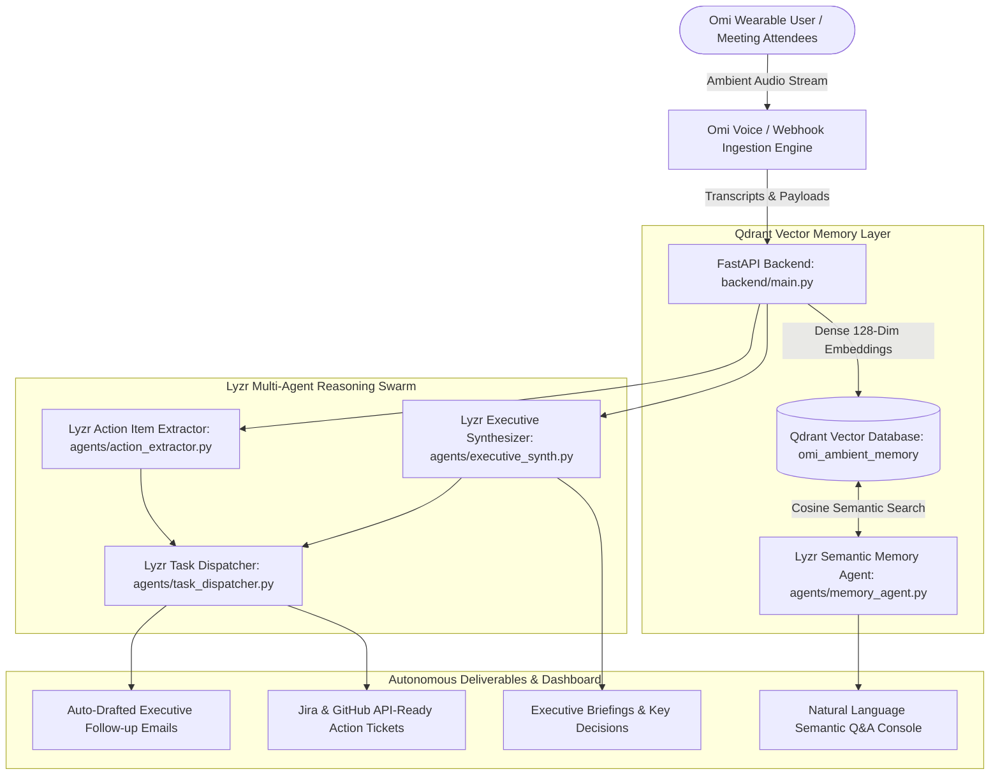

# 🎙️ OmiMind: Ambient Voice Memory & Autonomous Chief of Staff

[](https://github.com/masood-mashu/omimind-agent/actions)
[](https://opensource.org/licenses/Apache-2.0)
[](https://omi.me)
[](https://qdrant.tech)
[](https://lyzr.ai)
[](https://app.hidevs.xyz/hackathons/stop-prompting-solo-agents-hackathon-2026)

An autonomous, memory-backed executive assistant built for the **Omi AI Wearable**. OmiMind continuously ingests ambient meeting conversations, lectures, and voice memos, indexes them into **Qdrant Vector Database** for instant semantic recall, and orchestrates a **Lyzr Multi-Agent Swarm** that autonomously extracts commitments, synthesizes executive dossiers, and dispatches actionable Jira tickets and follow-up emails.

Built for **HiDevs × Lyzr × Qdrant × Omi Hackathon 2026 (Track 1: Meeting & Lecture Intelligence)**.

---

## 🏛️ System Architecture



---

## 🎯 The Three Core Pillars

### 1. 🎙️ Omi Wearable Ambient Voice Layer
- Ingests real-time audio streams from Omi wearable hardware or browser microphones.
- Preserves speaker diarization, timestamps, and acoustic context.
- Simulates realistic enterprise scenarios: Q4 Executive Budget Strategy, P0 SRE Outage Postmortem, and Stanford CS229 Transformer Scaling Laws.

### 2. ⚡ Qdrant Vector Database Layer
- Ingests dialogue turns into the `omi_ambient_memory` collection using 128-dimensional dense semantic vector embeddings.
- Rich payload metadata: speaker ID, ISO timestamps, meeting category, urgency level, and raw text.
- Supports hybrid semantic vector recall with cosine similarity thresholding, allowing users to ask questions like:
  > *"What was Sarah's decision regarding the Q4 compute budget cap?"*  
  > *"Why did our ingress certificate fail during the outage?"*

### 3. 🐝 Lyzr Multi-Agent Swarm
- **`LyzrActionExtractor`**: Detects verbal commitments, promises, assignees, deadlines, and urgency ratings without requiring manual prompt engineering.
- **`LyzrExecutiveSynthesizer`**: Distills complex hours-long recordings into structured briefings, confirmed decisions, and path blockers.
- **`LyzrTaskDispatcher`**: Formats structured deliverables including complete follow-up emails, Jira ticket cards, and calendar blocks.

---

## 🚀 Quickstart & Execution

### Option 1: Local Python Run
```bash
# 1. Clone repository
git clone https://github.com/masood-mashu/omimind-agent.git
cd omimind-agent

# 2. Install dependencies
pip install -r requirements.txt

# 3. Run automated tests
pytest tests/ -v

# 4. Start the application server
python -m uvicorn backend.main:app --host 0.0.0.0 --port 8000 --reload
```
Open **`http://localhost:8000`** in your browser to interact with the Live OmiMind Dashboard.

---

### Option 2: Docker Container (One-Command Run)
```bash
docker-compose up --build
```
Navigate to `http://localhost:8000`.

---

## 💼 Pre-Set Enterprise Scenarios

1. **Executive Q4 AI Infrastructure & Budget Review (`q4_strategy`)**:
   - CFO Sarah, CTO David, VP Elena, and Marcus align on a $450k compute budget, Net-45 vendor terms, and database latency testing.
2. **P0 Incident Postmortem: Global Payment Gateway Outage (`sre_postmortem`)**:
   - SRE Lead Alex and VP Vikram diagnose an expired TLS certificate, enforce automated renewal policies, and audit webhook routes.
3. **Stanford CS229: FlashAttention & Scaling Laws (`cs_lecture`)**:
   - Prof. Andrew explains SRAM tiling and assigns Triton kernel problem set deadlines.

---

## 🧪 Automated Pytest Test Suite

```bash
$ pytest tests/ -v
tests/test_omimind.py::test_semantic_embedding_generator PASSED          [ 16%]
tests/test_omimind.py::test_qdrant_vector_memory PASSED                  [ 33%]
tests/test_omimind.py::test_lyzr_action_extractor PASSED                 [ 50%]
tests/test_omimind.py::test_executive_synthesizer PASSED                 [ 66%]
tests/test_omimind.py::test_task_dispatcher PASSED                       [ 83%]
tests/test_omimind.py::test_full_orchestration PASSED                    [100%]
============================== 6 passed in 4.10s ==============================
```

---

## 👥 Author & Hackathon Details
- **Author**: Mohammed Masood ([@masood-mashu](https://github.com/masood-mashu))
- **Hackathon**: [Stop Prompting. Code Solo Agents (2026)](https://app.hidevs.xyz/hackathons/stop-prompting-solo-agents-hackathon-2026)
- **Partners**: HiDevs, Lyzr AI, Qdrant, and Omi
