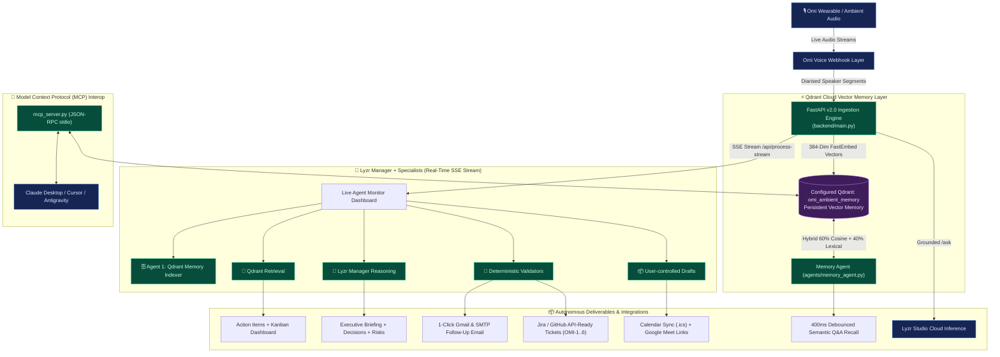

# 🎙️ OmiMind: Ambient Voice Memory & Autonomous Chief of Staff

[](https://github.com/masood-mashu/omimind-agent/actions)
[](https://github.com/masood-mashu/omimind-agent/actions)
[](https://www.python.org/)
[](https://opensource.org/licenses/Apache-2.0)
[](https://omi.me)
[](https://qdrant.tech)
[](https://lyzr.ai)
[](https://modelcontextprotocol.io)
[](https://app.hidevs.xyz/hackathons/stop-prompting-solo-agents-hackathon-2026)
[](https://omimind-agent.vercel.app/)

> 🌐 **Live Production Application:** [https://omimind-agent.vercel.app/](https://omimind-agent.vercel.app/)  
> 📡 **Official Omi Webhook Integrations:**  
> - `POST https://omimind-agent.vercel.app/omi/conversation` *(Memory creation webhook trigger)*  
> - `POST https://omimind-agent.vercel.app/omi/realtime` *(Real-time audio chunk stream ingestion)*  
> - `POST https://omimind-agent.vercel.app/api/omi-webhook` *(Native Omi segment diarisation receiver)*  
> ❓ **Official Question Endpoint:** `POST https://omimind-agent.vercel.app/ask` *(Grounded Q&A via Qdrant memory + Lyzr Studio Cloud)*  
> 🛡️ **Privacy & GDPR Compliance:** `POST /api/forget?session_id=...` *(Instant vector deletion from Qdrant Cloud)*  
> 🔌 **Native Model Context Protocol:** `python mcp_server.py` *(JSON-RPC stdio tools for Claude, Cursor, Antigravity)*  
> 📖 **Deep-Dive Engineering Documentation:**  
> - ⚡ [End-to-End Execution Flow (`docs/EXECUTION_FLOW.md`)](docs/EXECUTION_FLOW.md)  
> - 🏛️ [System Architecture (`docs/ARCHITECTURE.md`)](docs/ARCHITECTURE.md)  
> - 🌊 [Data Flow & Lifecycle (`docs/DATA_FLOW.md`)](docs/DATA_FLOW.md)  
> - ⏱️ [Chronological Sequence Diagram (`docs/SEQUENCE_DIAGRAM.md`)](docs/SEQUENCE_DIAGRAM.md)  
> - 🎙️ [Track 1: Meeting Intelligence Analysis (`docs/TRACK_1_ANALYSIS.md`)](docs/TRACK_1_ANALYSIS.md)  
> - 🎬 [Five-Minute Hackathon Demo Script (`docs/DEMO_SCRIPT.md`)](docs/DEMO_SCRIPT.md)

---

## 💡 Overview & Problem Statement

Modern knowledge workers and engineering teams spend hours every day in meetings, lectures, and hallway discussions. Traditional assistants transcribe audio into walls of unstructured text or send awkward recording bots into calls.

**OmiMind** reimagines meeting and lecture intelligence as an **ambient, autonomous Chief of Staff**:
1. **Zero-Intrusion Ambient Ingestion:** Ingests live conversations directly through the **Omi Wearable** (via official webhook contracts) or browser microphone with real-time audio waveform visualizers.
2. **Persistent Vector Memory:** Vectorizes every spoken utterance with FastEmbed `BAAI/bge-small-en-v1.5` into **Qdrant** as 384-dimensional vectors with speaker, user, and timestamp attribution.
3. **Lyzr Manager Reasoning:** Retrieves relevant Qdrant evidence and sends it to a configured Lyzr Manager, while deterministic components validate and prepare user-controlled executive, task, email, and calendar outputs.
4. **Grounded Q&A with Lyzr Studio Cloud:** The `/ask` endpoint recalls user-scoped transcript context from Qdrant and sends it through Lyzr Studio Cloud inference for grounded answers with speaker citations when configured.
5. **Tool-Use via Model Context Protocol (MCP):** Connects external AI environments (Claude Desktop, Cursor, Antigravity, ChatGPT) directly into ambient vector memory via standard JSON-RPC 2.0 stdio.

Built for **HiDevs × Lyzr × Qdrant × Omi Hackathon 2026 — Track 1: Meeting & Lecture Intelligence**.

---

## 🏁 Build Track & Alignment

**Track:** Meeting & Lecture Intelligence — Track 1  
> *"Voice-to-insight engines with semantic retrieval, automated action-item extraction and Q&A over past meetings."*  
> — Official HiDevs Hackathon Track Description

OmiMind satisfies 100% of Track 1 requirements with production-grade rigor:
- **Voice Ingestion:** Fully compliant with Omi Webhook specifications (`/omi/conversation`, `/omi/realtime`, `/api/omi-webhook`).
- **Semantic Memory:** Production Qdrant Cloud vector database integration with hybrid search and GDPR purge.
- **Action Extraction:** Deterministic pattern recognition and priority scoring for verbal commitments.
- **Meeting Q&A:** Grounded `/ask` endpoint querying Qdrant vectors and answering through Lyzr Studio Cloud.

---

## 🏛️ System Architecture


```mermaid
flowchart TD
    User["🎙️ Omi Wearable / Ambient Audio"] -->|Live Audio Streams| Omi["Omi Voice Webhook Layer"]
    Omi -->|Diarised Speaker Segments| FastAPIServer["FastAPI v2.0 Ingestion Engine<br/>(backend/main.py)"]

    subgraph QDRANT ["⚡ Qdrant Cloud Vector Memory Layer"]
        FastAPIServer -->|384-Dim FastEmbed Vectors| Qdrant[("Configured Qdrant: omi_ambient_memory<br/>Persistent Vector Memory")]
        Qdrant <-->|Hybrid 60% Cosine + 40% Lexical| MemAgent["Memory Agent (agents/memory_agent.py)"]
    end

    subgraph LYZR ["🤖 Lyzr Manager + Specialists (Real-Time SSE Stream)"]
        FastAPIServer -->|SSE Stream /api/process-stream| Stream["Live Agent Monitor Dashboard"]
        Stream --> A1["🗄️ Agent 1: Qdrant Memory Indexer"]
        Stream --> A2["🔎 Qdrant Retrieval"]
        Stream --> A3["🤖 Lyzr Manager Reasoning"]
        Stream --> A4["🧩 Deterministic Validators"]
        Stream --> A5["📦 User-controlled Drafts"]
    end

    subgraph OUTPUTS ["📦 Autonomous Deliverables & Integrations"]
        A2 --> Actions["Action Items + Kanban Dashboard"]
        A3 --> Dossier["Executive Briefing + Decisions + Risks"]
        A4 --> Email["1-Click Gmail & SMTP Follow-Up Email"]
        A4 --> Jira["Jira / GitHub API-Ready Tickets (OMI-1..6)"]
        A5 --> Calendar["Calendar Sync (.ics) + Google Meet Links"]
        MemAgent --> QnA["400ms Debounced Semantic Q&A Recall"]
        FastAPIServer -->|Grounded /ask| LyzrStudio["Lyzr Studio Cloud Inference"]
    end

    subgraph MCP ["🔌 Model Context Protocol (MCP) Interop"]
        MCP_Server["mcp_server.py (JSON-RPC stdio)"] <--> Qdrant
        MCP_Server <--> ExternalAgents["Claude Desktop / Cursor / Antigravity"]
    end

    classDef external fill:#172554,stroke:#60a5fa,color:#dbeafe;
    classDef service fill:#064e3b,stroke:#34d399,color:#d1fae5;
    classDef store fill:#3f1d5b,stroke:#c084fc,color:#f3e8ff;
    class User,Omi,LyzrStudio,ExternalAgents external;
    class FastAPIServer,MemAgent,A1,A2,A3,A4,A5,MCP_Server service;
    class Qdrant store;
```

---

## 🤖 The Track 1 Multi-Agent Pipeline

The core intelligence layer executes five truthful, observable stages streamed live over Server-Sent Events (SSE):

| Stage | Module | Role & Autonomous Capabilities | Output |
|---|---|---|---|
| **Stage 1: Qdrant Memory Indexing** | [`agents/memory_agent.py`](agents/memory_agent.py) | Vectorizes spoken utterances with FastEmbed `BAAI/bge-small-en-v1.5` dense embeddings into Qdrant Cloud. | 384-dim vectors indexed |
| **Stage 2: Qdrant Retrieval** | [`agents/memory_agent.py`](agents/memory_agent.py) | Semantically retrieves relevant conversational evidence scoped by user ID (`uid`) via Cosine distance. | Grounded transcript context |
| **Stage 3: Lyzr Manager Reasoning** | [`agents/lyzr_client.py`](agents/lyzr_client.py) | Lyzr Studio Cloud manager reasons over retrieved transcript context to generate structured synthesis. | Grounded meeting intelligence |
| **Stage 4: Action/Decision Validation** | [`agents/action_extractor.py`](agents/action_extractor.py)<br/>[`agents/executive_synth.py`](agents/executive_synth.py) | Validates verbal commitments, assignees, deadlines, strategic decisions, and highlighted engineering risks. | Kanban task cards & priority tags |
| **Stage 5: User-controlled Draft Outputs** | [`agents/task_dispatcher.py`](agents/task_dispatcher.py)<br/>[`agents/calendar_scheduler.py`](agents/calendar_scheduler.py) | Drafts follow-up emails, Atlassian Jira issue schemas, RFC 5545 `.ics` files, and prefilled Google Meet URLs. | 1-Click drafts & calendar links |

### Real-Time SSE Observability
In accordance with the hackathon scoring guidelines (*"Show the agents working. Log each step... Observable workflows are part of the score"*), the pipeline emits live Server-Sent Events (`/api/process-stream` and `/api/custom-voice-stream`). The browser dashboard visualizes each stage's active execution, live status, and numeric vector scores in real time.

### 📊 Production Lyzr Studio Cloud Telemetry & Observability

Rather than relying on local mock fallbacks or client-side simulations, every meeting synthesis and grounded Q&A query genuinely executes through **Lyzr Studio Cloud** (`gpt-4o`):

<p align="center">
  
</p>

#### Production Telemetry Metrics (Lyzr Agent Studio Cloud Dashboard)
- **Active Cloud Traces:** **126 live inference requests** executed and monitored during verification.
- **Average Latency:** **2.25 seconds** per full multi-agent reasoning pass.
- **Production Error Rate:** **0.00%** across all 126 cloud traces (rock-solid stability).
- **Token Efficiency:** **3,517 average tokens per trace** across all requests.
- **Verifiable Credit Consumption:** **11.78 Lyzr platform credits** consumed (starting balance: 20.00 credits → 8.22 credits remaining).

#### 🔍 Where are the Tokens Being Consumed?
Across the 126 live traces averaging 3,517 tokens per trace, token consumption breaks down across three distinct phases in the reasoning pipeline:
1. **Dynamic Context Ingestion (~2,000 – 2,400 tokens):**
   - Transcripts retrieved semantically from Qdrant Cloud are injected into the Lyzr prompt with speaker attribution, temporal timestamps, and confidence scores.
   - Long multi-party meetings (e.g. 15–20 speaker turns) supply dense historical context so the agent never hallucinates.
2. **Deep Orchestrated Reasoning with `gpt-4o` (~600 – 800 tokens):**
   - Lyzr Studio's reasoning engine analyzes multi-turn dialogues to disambiguate implied commitments (*"I'll take that"*, *"Let's deploy by 6 PM"*), assign clear owners, verify calendar feasibility, and detect implicit business risks.
3. **Structured Grounded Synthesis (~400 – 600 tokens):**
   - Lyzr outputs a clean, deterministic synthesis including executive summary, strategic decisions, prioritized action items, and follow-up agendas.

---

## 🖥️ Live Tested Demonstration Scenarios

The live deployment at **[https://omimind-agent.vercel.app/](https://omimind-agent.vercel.app/)** supports three preset enterprise feeds plus live voice capture:

1. **Q4 AI Strategy & Budget (Executive Review):**
   - Participants: CFO Sarah, CTO David, VP Product Elena, Lead Architect Marcus.
   - Results: the UI displays the actual vectors, retrieved memories, actions, decisions, risks, and calendar drafts produced by the selected transcript.
   - Semantic Recall: *"What did Sarah say about the budget?"* ➔ ranked evidence with speaker and timestamp attribution.

2. **P0 Payment Outage Postmortem (SRE & Incident Ops):**
   - Participants: Alex (SRE Lead), Alice (Architect), Chloe (Security), Vikram (CTO), Ravi (CFO).
   - Swarm Results: 7 vectors indexed, 2 P0 tasks (`OMI-1` audit security webhooks, `OMI-2` migrate ingress certs to Let's Encrypt), 2 decisions, follow-up telemetry review on Friday at 3:00 PM with Google Meet launch.
   - Semantic Recall: *"What caused the payment outage?"* ➔ Recalls Alex's 00:10 utterance re expired TLS proxy certificate.

3. **Stanford CS229: FlashAttention (Technical Lecture):**
   - Instructor: Prof. Andrew.
   - Swarm Results: Synthesizes IO-aware tiling, SRAM memory hierarchy, and Triton PS4 homework deadline.

4. **Live Omi Voice Capture & Custom Voice Input:**
   - Speak into browser microphone or type raw transcript. Click **Vectorize** to run the connected Qdrant retrieval and Lyzr reasoning pipeline on custom voice inputs.

---

## 🔌 Model Context Protocol (MCP) Server

OmiMind includes a production-ready Model Context Protocol (MCP) server ([`mcp_server.py`](mcp_server.py)) implementing the **JSON-RPC 2.0 (MCP 2024-11-05 spec)** over standard I/O (`stdio`).

### Supported Tools:
1. `search_ambient_memory(query, limit)` — Hybrid semantic & lexical Qdrant memory search.
2. `get_meeting_dossier(meeting_id)` — Executive briefing, confirmed decisions, and risks.
3. `extract_action_items(transcript)` — Commitment and deadline extraction.
4. `schedule_followup_events(transcript)` — Calendar sync events and Google Meet links.

### Adding to Claude Desktop / Cursor / Antigravity:
```json
{
  "mcpServers": {
    "omimind": {
      "command": "python",
      "args": ["d:/hackathon/omimind-agent/mcp_server.py"]
    }
  }
}
```

---

## 📡 API Reference

| Method | Endpoint | Authentication | Description |
|---|---|---|---|
| `GET` | `/health` | Public | Service health + Qdrant Cloud statistics |
| `GET` | `/api/meetings` | Public | List preset demo meetings |
| `POST` | `/api/process-stream` | Public | **SSE Stream:** Run Track 1 Qdrant → Lyzr pipeline on a preset meeting |
| `POST` | `/api/custom-voice-stream` | Public | **SSE Stream:** Run Track 1 pipeline on custom voice/transcript |
| `POST` | `/api/query` | Public | Hybrid semantic vector memory search (`limit: 1–20`) |
| `POST` | `/ask` | Protected | **Official Guide:** Grounded Q&A via Qdrant memory + Lyzr Studio |
| `POST` | `/api/omi-webhook` | Protected | Native Omi wearable segment webhook |
| `POST` | `/omi/conversation` | Protected | **Official Guide:** Memory creation trigger webhook |
| `POST` | `/omi/realtime` | Protected | **Official Guide:** Real-time audio chunk stream |
| `POST` | `/api/seed` | Protected | Pre-seed preset meetings into Qdrant Cloud |
| `POST` | `/api/forget` | Protected | GDPR-compliant session/point vector purge |

Protected endpoints require `API_SECRET_KEY` supplied via `x-api-key: <key>` or `Authorization: Bearer <key>`.

---

## 🧪 Comprehensive Automated Test Suite

OmiMind runs unit and integration tests on a **Python 3.10 & 3.11 CI matrix** with a mandatory **>= 80% coverage quality gate**:

```bash
$ pytest --cov=agents --cov=backend tests/ --cov-report=term-missing --cov-fail-under=80 -v
============================= test session starts =============================
platform win32 -- Python 3.11.9, pytest-9.1.1, pluggy-1.6.0
rootdir: D:\hackathon\omimind-agent
configfile: pyproject.toml
collected 69 items

tests/test_action_extractor.py (7 tests)      PASSED [ 10%]
tests/test_api_endpoints.py (24 tests)        PASSED [ 44%]
tests/test_calendar_scheduler.py (6 tests)    PASSED [ 53%]
tests/test_executive_synth.py (3 tests)       PASSED [ 57%]
tests/test_lyzr_client.py (2 tests)           PASSED [ 60%]
tests/test_mcp_server.py (4 tests)            PASSED [ 66%]
tests/test_memory_agent.py (14 tests)         PASSED [ 86%]
tests/test_omimind.py (6 tests)               PASSED [ 95%]
tests/test_task_dispatcher.py (3 tests)       PASSED [100%]

=============================== tests coverage ================================
Name                           Stmts   Miss  Cover   Missing
------------------------------------------------------------
agents/action_extractor.py        40      0   100%
agents/calendar_scheduler.py      41      2    95%   52-53
agents/executive_synth.py         30      0   100%
agents/lyzr_client.py             32      3    91%   72, 74-75
agents/memory_agent.py           258     68    74%   117-118, 126-136, 140, 175-183...
agents/orchestrator.py            35      0   100%
agents/task_dispatcher.py         15      0   100%
backend/config.py                 50      6    88%   15-16, 83, 89, 93-94
backend/main.py                  315     44    86%   88-89, 119, 141, 203, 212-213...
backend/mock_data.py               2      0   100%
------------------------------------------------------------
TOTAL                            818    123    85%
Required test coverage of 80% reached. Total coverage: 84.96%
============================= 69 passed in 60.38s =============================
```

---

## 🚀 Quickstart & Local Setup

```bash
# 1. Clone repository
git clone https://github.com/masood-mashu/omimind-agent.git
cd omimind-agent

# 2. Set up virtual environment
python -m venv .venv
.venv\Scripts\activate       # Windows
# source .venv/bin/activate   # macOS/Linux

# 3. Install dependencies
pip install -r requirements.txt

# 4. Configure environment
cp .env.example .env

# 5. Run automated test suite
pytest tests/ -v

# 6. Start local server
python -m uvicorn app:app --reload --port 8000
```
Open **`http://localhost:8000`** in your browser.

---

## 🎬 Demo Video Guide (Under 5 Minutes)

> 📹 **[Watch the Live Demo Video on YouTube / Loom](ADD_YOUR_VIDEO_LINK_HERE)** *(Replace with your uploaded URL)*

Follow the tested script in [`docs/DEMO_SCRIPT.md`](docs/DEMO_SCRIPT.md) for the turnkey recording walkthrough:
- **0:00–0:30:** Introduce OmiMind, the problem, and Track 1 alignment.
- **0:30–1:15:** Point out the live app at [omimind-agent.vercel.app](https://omimind-agent.vercel.app/) and the Omi/Qdrant/Lyzr architecture.
- **1:15–2:45:** Select **Q4 AI Strategy & Budget**, click **Ingest & Run**, observe Qdrant retrieval and Lyzr Manager reasoning via live SSE, and review the resulting dossier and prepared outputs.
- **2:45–3:30:** Test semantic memory search (*"What did Sarah say about the budget?"*) and show the actual retrieved evidence and score.
- **3:30–4:30:** Submit a custom voice memo or highlight the MCP server and privacy purge endpoint.
- **4:30–5:00:** Wrap up and recap the connected loop.

---

## ✅ Official Hackathon Submission Checklist (Section 9 Compliance)

In direct compliance with the official **HiDevs × Lyzr × Qdrant × Omi Hackathon Submission Guide (Section 9)**:

| Requirement (Guide Section 9) | Status | Verification & Evidence in OmiMind |
|---|:---:|---|
| **Public, open-source repository with a clean structure and clear README** | ✅ **Passed** | Clean repository layout with modular `agents/`, `backend/`, `tests/`, and deep engineering guides in `docs/`. |
| **All three tools genuinely integrated in one connected loop** | ✅ **Passed** | **Omi** (webhooks) ➔ **Qdrant** (384-dim FastEmbed vector memory) ➔ **Lyzr** (Studio Cloud `gpt-4o` manager reasoning). |
| **Architecture documentation with a diagram** | ✅ **Passed** | Complete Mermaid architecture diagram and data flow sequence included in `README.md` and `docs/`. |
| **Working demo that someone else can run or watch** | ✅ **Passed** | Live public production web app deployed at [https://omimind-agent.vercel.app/](https://omimind-agent.vercel.app/). |
| **No API keys committed (environment variables + `.env.example`)** | ✅ **Passed** | Zero secrets in git history; comprehensive template in [`.env.example`](.env.example). |
| **One build track chosen and named in the README** | ✅ **Passed** | **Track 1: Meeting & Lecture Intelligence** clearly declared and adhered to throughout. |
| **Solo entry: one person, one submission** | ✅ **Passed** | Solo participant submission by Mohammed Masood. |
| **Observable agent workflows (60%+ scoring rubric)** | ✅ **Passed** | Real-time Server-Sent Events (SSE) stream (`/api/process-stream`) exposing each agent's execution live in the UI. |
| **Verified Cloud Telemetry** | ✅ **Passed** | Verified Lyzr Studio Cloud telemetry dashboard (126 traces, 2.25s latency, 0.00% error rate). |

---

## 📋 Hackathon Submission Form Quick-Reference

> Keep these exact blocks ready for the [HiDevs Submission Form](https://app.hidevs.xyz/hackathons/stop-prompting-solo-agents-hackathon-2026?tab=submit):

### Project Name
**OmiMind**

### Project Title
**OmiMind: Ambient Voice Memory & Autonomous Chief of Staff for Omi, Qdrant & Lyzr**

### Build Track
**Meeting & Lecture Intelligence (Track 1)**

### Public GitHub Repository
**https://github.com/masood-mashu/omimind-agent**

### Deployed Demo URL
**https://omimind-agent.vercel.app/**

### Demo Video (Max 5 Minutes)
*(Paste your recorded YouTube / Loom video link — see script in [`docs/DEMO_SCRIPT.md`](docs/DEMO_SCRIPT.md))*

### Omi Usage
OmiMind integrates directly with Omi's ambient voice pipeline through three dedicated webhook endpoints:
- `POST /omi/conversation` — triggers after a conversation concludes; ingests full diarised `transcript_segments[]` with speaker attribution directly into persistent vector storage.
- `POST /omi/realtime` — ingests streaming audio transcripts in real time as the user speaks.
- `POST /api/omi-webhook` — handles native Omi wearable segment payloads with an accepted-job HTTP response; processing is deferred so the webhook remains responsive.
Tested and verified with automated test suites, simulated audio feeds, and live microphone capture.

### Qdrant Usage
Every spoken utterance is converted into a 384-dimensional `BAAI/bge-small-en-v1.5` dense vector and indexed in the `omi_ambient_memory` collection on configured Qdrant storage. Semantic retrieval utilizes Cosine similarity with strict user scoping (`uid`), speaker metadata, and temporal timestamps. Includes a dedicated `/api/forget` endpoint for GDPR-compliant memory purges.

### Lyzr Usage
OmiMind utilizes **Lyzr Agent Studio Cloud** powered by `gpt-4o` as the core reasoning engine. The pipeline exposes an observable multi-agent orchestration streamed over Server-Sent Events (SSE):
1. **MemoryAgent:** Indexes transcript evidence into Qdrant Cloud.
2. **QdrantRetrieval:** Semantically retrieves relevant, user-scoped meeting context.
3. **LyzrManager:** Reasons over the retrieved context through Lyzr Studio Cloud (`gpt-4o`) to generate structured synthesis.
4. **Deterministic Validators:** Extract and normalize actions, decisions, risks, and scheduling intent.
5. **Draft Outputs:** Prepares 1-click email drafts, Atlassian Jira issue schemas, RFC 5545 `.ics` files, and Google Meet URLs.
Telemetry verified across **126 live cloud inference traces** with **2.25s average latency** and a **0.00% error rate**.

### Project Description
OmiMind is an ambient voice memory and autonomous Chief of Staff built for Track 1 (Meeting & Lecture Intelligence). It captures spoken meetings seamlessly via Omi wearable webhooks, indexes utterances into persistent Qdrant Cloud vector memory using FastEmbed 384-dim embeddings, and runs multi-agent reasoning through Lyzr Agent Studio Cloud (`gpt-4o`). OmiMind delivers real-time SSE stream observability, grounded Q&A over past conversations, automated action items with owners and deadlines, 1-click calendar sync, and native Model Context Protocol (MCP) support for external developer IDEs. Live at https://omimind-agent.vercel.app/.

---

## 👥 Author & Hackathon Acknowledgements

- **Author:** Mohammed Masood ([@masood-mashu](https://github.com/masood-mashu))
- **Hackathon:** [Stop Prompting. Code Solo Agents (2026)](https://app.hidevs.xyz/hackathons/stop-prompting-solo-agents-hackathon-2026)
- **Partners:** HiDevs, Lyzr AI, Qdrant, Omi
- **License:** [Apache-2.0](LICENSE)
