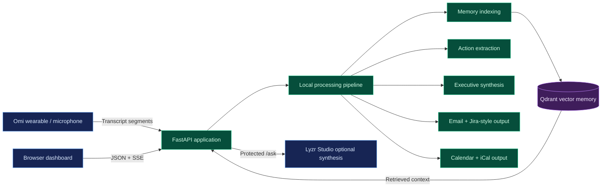

# OmiMind

OmiMind is an ambient meeting-intelligence assistant. It turns voice transcripts into searchable memory, executive summaries, decisions, risks, action items, follow-up emails, Jira-style tickets, and calendar events.

The project is built for the HiDevs × Lyzr × Qdrant × Omi hackathon and includes a browser dashboard with live Server-Sent Events (SSE) progress updates.

**Build track:** Meeting & Lecture Intelligence — Track 1

## Demo

Live application: [omimind-agent.vercel.app](https://omimind-agent.vercel.app/)

The dashboard supports:

- Preset meeting scenarios
- Custom transcript ingestion
- Live five-stage processing progress
- Semantic memory recall
- Executive summaries, action items, Jira-style tickets, and calendar links
- Browser microphone capture where supported

## How it works

```text
Omi wearable / microphone / transcript
                ↓
          FastAPI ingestion
                ↓
       Qdrant vector memory
                ↓
Action extraction + executive synthesis
                ↓
Email, tickets, calendar events, dashboard
```

The main processing pipeline is implemented locally in `agents/`. Lyzr Studio integration is available for the protected `/ask` grounded Q&A endpoint when Lyzr credentials are configured.

The public preset feeds use transcript simulation for a repeatable demo. The protected Omi-compatible webhook routes support real Omi transcript payloads.

## Architecture


```mermaid
flowchart LR
    Omi["Omi wearable / microphone"] -->|Transcript segments| API["FastAPI application"]
    Browser["Browser dashboard"] -->|JSON + SSE| API

    API --> Pipeline["Local processing pipeline"]
    Pipeline --> Memory["Memory indexing"]
    Pipeline --> Actions["Action extraction"]
    Pipeline --> Synthesis["Executive synthesis"]
    Pipeline --> Dispatch["Email + Jira-style output"]
    Pipeline --> Calendar["Calendar + iCal output"]

    Memory --> Qdrant[("Qdrant vector memory")]
    Qdrant -->|Retrieved context| API
    API -->|Protected /ask| Lyzr["Lyzr Studio optional synthesis"]

    classDef external fill:#172554,stroke:#60a5fa,color:#dbeafe;
    classDef service fill:#064e3b,stroke:#34d399,color:#d1fae5;
    classDef store fill:#3f1d5b,stroke:#c084fc,color:#f3e8ff;
    class Omi,Browser,Lyzr external;
    class API,Pipeline,Memory,Actions,Synthesis,Dispatch,Calendar service;
    class Qdrant store;
```

## Quick start

Requirements: Python 3.10+.

```bash
git clone https://github.com/masood-mashu/omimind-agent.git
cd omimind-agent

python -m venv .venv
.venv\Scripts\activate       # Windows
# source .venv/bin/activate   # macOS/Linux

pip install -r requirements.txt
copy .env.example .env        # Windows
# cp .env.example .env        # macOS/Linux

python -m uvicorn app:app --reload --port 8000
```

Open [http://localhost:8000](http://localhost:8000).

## Configuration

Copy `.env.example` to `.env` and set values for the integrations you use:

```env
API_SECRET_KEY=replace_with_a_long_random_secret
ALLOWED_ORIGINS=http://localhost:8000,http://127.0.0.1:8000

QDRANT_URL=
QDRANT_API_KEY=
LYZR_API_KEY=
LYZR_AGENT_ID=
LYZR_USER_ID=
OMI_API_KEY=
```

The preset demo flow can run with local fallback storage. Configure Qdrant for persistent vector memory and configure Lyzr for external grounded Q&A.

Protected endpoints are disabled unless `API_SECRET_KEY` is configured. Send the key using either:

```http
x-api-key: your-secret
```

or:

```http
Authorization: Bearer your-secret
```

Treat transcripts and provider credentials as sensitive data. Never commit `.env` or API keys.

## API reference

| Method | Route | Authentication | Purpose |
|---|---|---|---|
| `GET` | `/health` | Public | Service and vector-store health |
| `GET` | `/api/meetings` | Public | List preset meetings |
| `POST` | `/api/process-stream` | Public demo route | Stream preset meeting processing |
| `POST` | `/api/custom-voice-stream` | Public demo route | Stream custom transcript processing |
| `POST` | `/api/query` | Public demo route | Search semantic memory; `limit` is 1–20 |
| `POST` | `/ask` | Protected | Grounded Q&A with optional Lyzr Studio synthesis |
| `POST` | `/api/omi-webhook` | Protected | Ingest Omi segment payloads |
| `POST` | `/omi/conversation` | Protected | Ingest completed Omi conversations |
| `POST` | `/omi/realtime` | Protected | Ingest realtime Omi transcript segments |
| `POST` | `/api/seed` | Protected | Seed preset data |
| `POST` | `/api/forget` | Protected | Delete memory by session or point ID |

Example semantic query:

```bash
curl -X POST http://localhost:8000/api/query \
  -H "Content-Type: application/json" \
  -d '{"question":"What did Sarah say about the budget?","limit":4}'
```

## Testing and quality

Run the automated checks with:

```bash
pytest -q --cov=agents --cov=backend --cov-report=term-missing --cov-fail-under=80
ruff check .
```

The current verified baseline is:

- 58 tests passing
- 87.77% coverage
- Ruff checks passing
- Local UI swarm flow verified
- Production demo flow and semantic recall verified

## Project structure

```text
agents/       Meeting processing and agent stages
api/          Vercel entrypoint
backend/      FastAPI application and configuration
frontend/     Browser dashboard
tests/        API and agent tests
docs/         Architecture and execution-flow notes
mcp_server.py MCP stdio server for external AI clients
```

## MCP server

Run the local MCP server over stdio:

```bash
python mcp_server.py
```

Available tools include semantic memory search, meeting dossier generation, action extraction, and follow-up event generation.

## Additional documentation

- [Architecture diagram](docs/ARCHITECTURE.md)
- [Data-flow diagram](docs/DATA_FLOW.md)
- [Sequence diagram](docs/SEQUENCE_DIAGRAM.md)
- [Execution flow](docs/EXECUTION_FLOW.md)
- [Track 1 analysis](docs/TRACK_1_ANALYSIS.md)
- [Five-minute demo script](docs/DEMO_SCRIPT.md)
- [License](LICENSE)

## Demo video

Record a public video under five minutes using [the demo script](docs/DEMO_SCRIPT.md), then add its YouTube or Loom URL here and in the hackathon submission form. No placeholder URL is included.

## Docker

```bash
docker compose up --build
```

Docker Compose requires `API_SECRET_KEY` to be set before startup.
