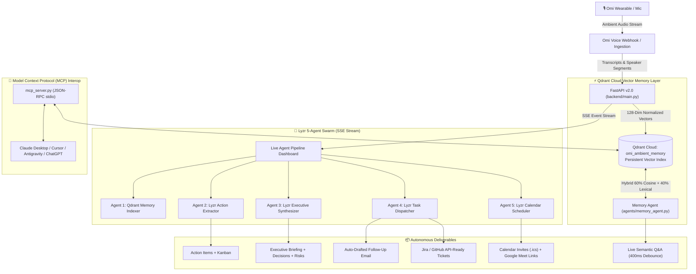

# 🎙️ OmiMind: Ambient Voice Memory & Autonomous Chief of Staff

[](https://github.com/masood-mashu/omimind-agent/actions)
[](https://opensource.org/licenses/Apache-2.0)
[](https://omi.me)
[](https://qdrant.tech)
[](https://lyzr.ai)
[](https://modelcontextprotocol.io)
[](https://app.hidevs.xyz/hackathons/stop-prompting-solo-agents-hackathon-2026)
[](https://omimind-agent.vercel.app/)

> 🌐 **Live Production Demo:** [https://omimind-agent.vercel.app/](https://omimind-agent.vercel.app/)  
> 📡 **Omi Webhook Endpoints:**  
> - `POST https://omimind-agent.vercel.app/omi/conversation` *(Official Guide: Memory creation trigger)*  
> - `POST https://omimind-agent.vercel.app/omi/realtime` *(Official Guide: Real-time chunk stream)*  
> - `POST https://omimind-agent.vercel.app/api/omi-webhook` *(Native Omi segment receiver)*  
> ❓ **Official Question Endpoint:** `POST https://omimind-agent.vercel.app/ask`  
> 🛡️ **Privacy & User Control:** `POST /api/forget?session_id=...` *(Purge vectors from Qdrant)*  
> 🔌 **Native MCP Server:** `python mcp_server.py` *(Model Context Protocol stdio tools)*  
> 📖 **Deep-Dive Guides & Worked Examples:**  
> - ⚡ [Single Execution Flow & Sequence Diagram (`docs/EXECUTION_FLOW.md`)](docs/EXECUTION_FLOW.md)  
> - 🎙️ [Track 1: Meeting Intelligence Complete Analysis (`docs/TRACK_1_ANALYSIS.md`)](docs/TRACK_1_ANALYSIS.md)

An autonomous, memory-backed chief of staff built for the **Omi AI Wearable**. OmiMind continuously ingests ambient meeting conversations, lectures, and voice memos — indexes every utterance into **Qdrant Cloud** for permanent semantic recall — and orchestrates a **Lyzr 5-Agent Swarm** that streams live execution events via SSE as it autonomously extracts commitments, synthesizes executive dossiers, dispatches Jira tickets, and schedules calendar events with Google Meet and iCal links.

Built for **HiDevs × Lyzr × Qdrant × Omi Hackathon 2026 — Track 1: Meeting & Lecture Intelligence**.

---

## 🏛️ System Architecture


```mermaid
flowchart TD
    User["🎙️ Omi Wearable / Mic"] -->|Ambient Audio Stream| Omi["Omi Voice Webhook / Ingestion"]
    Omi -->|Transcripts & Speaker Segments| Server["FastAPI v2.0 (backend/main.py)"]

    subgraph QDRANT ["⚡ Qdrant Cloud Vector Memory Layer"]
        Server -->|128-Dim Normalized Vectors| Qdrant[("Qdrant Cloud: omi_ambient_memory<br/>Persistent Vector Index")]
        Qdrant <-->|Hybrid 60% Cosine + 40% Lexical| MemAgent["Memory Agent (agents/memory_agent.py)"]
    end

    subgraph LYZR ["🐝 Lyzr 5-Agent Swarm (SSE Stream)"]
        Server -->|SSE Event Stream| Stream["Live Agent Pipeline Dashboard"]
        Stream --> A1["Agent 1: Qdrant Memory Indexer"]
        Stream --> A2["Agent 2: Lyzr Action Extractor"]
        Stream --> A3["Agent 3: Lyzr Executive Synthesizer"]
        Stream --> A4["Agent 4: Lyzr Task Dispatcher"]
        Stream --> A5["Agent 5: Lyzr Calendar Scheduler"]
    end

    subgraph OUTPUTS ["📦 Autonomous Deliverables"]
        A2 --> Actions["Action Items + Kanban"]
        A3 --> Dossier["Executive Briefing + Decisions + Risks"]
        A4 --> Email["Auto-Drafted Follow-Up Email"]
        A4 --> Jira["Jira / GitHub API-Ready Tickets"]
        A5 --> Calendar["Calendar Invites (.ics) + Google Meet Links"]
        MemAgent --> QnA["Live Semantic Q&A (400ms Debounce)"]
    end

    subgraph MCP ["🔌 Model Context Protocol (MCP) Interop"]
        MCP_Server["mcp_server.py (JSON-RPC stdio)"] <--> Qdrant
        MCP_Server <--> ExternalAgents["Claude Desktop / Cursor / Antigravity / ChatGPT"]
    end
```

### Visual Dataflow Diagram

```
[🎙️ Omi Wearable / Mic]
         │ (Ambient Audio / Webhook)
         ▼
[POST /api/omi-webhook] ──► [FastAPI v2.0 Ingestion Engine]
                                   │
         ┌─────────────────────────┴────────────────────────┐
         ▼                                                  ▼
[⚡ Qdrant Cloud Vector Memory]                  [🐝 Lyzr 5-Agent Swarm]
 • 128-Dim Dense Embeddings                       (Real-Time SSE Stream)
 • omi_ambient_memory                                       │
 • Hybrid Search: 60% Cosine + 40% Lexical                 ├──► 🗄️ Memory Agent (Cloud Index)
 • 400ms Debounced Instant Query                          ├──► 🎯 Action Extractor (Kanban / Deadlines)
         │                                                 ├──► 🧠 Executive Synth (Decisions / Risks)
         ▼                                                 ├──► 📬 Task Dispatcher (Emails / Jira)
[🔍 Live Semantic Search]                                  └──► 📅 Calendar Scheduler (Google Meet / iCal)
                                                                    │
                                                                    ▼
                                                    [📋 Executive Dashboard & Action Suite]
```

---

## ✨ What Makes This Different

| Feature | Detail |
|---|---|
| **Live SSE 5-Agent Pipeline** | Watch all 5 Lyzr agents execute sequentially in real time — pulsing → ✓ with live count badges |
| **Qdrant Cloud Persistence** | Memory survives cold starts — pre-seeded with persistent embeddings, every session adds permanently |
| **Real Omi Webhook** | `POST /api/omi-webhook` accepts native Omi `segments[]` payload or flat transcript with auto speaker diarisation |
| **Hybrid Semantic Search** | 60% cosine vector + 40% lexical stem overlap — dynamic scores per query (e.g. 94% match) with speaker attribution |
| **📅 Auto Calendar Scheduler** | Detects follow-ups, creates RFC 5545 `.ics` files, and generates prefilled Google Meet launch links |
| **🔌 Native MCP Server** | Exposes OmiMind tools via standard Model Context Protocol for Claude, Cursor, and Antigravity |
| **Ambient Waveform Visualizer** | HTML5 Canvas audio wave paints real-time harmonic frequencies during idle and voice capture |
| **Tactile Micro-Interactions** | Spring physics buttons and floating toast alerts confirming copied emails, JSON, and downloaded invites |

---

## 🎯 The Core Pillars

### 1. 🎙️ Omi Wearable Ambient Voice Layer
- Native `POST /api/omi-webhook` endpoint accepts Omi's `{"segments": [{"speaker": "...", "text": "...", "start": 0.0}]}` payload directly from any Omi wearable device.
- Accepts flat transcript strings with auto speaker diarisation (regex `Name: text` detection).
- Live ambient audio visualizer canvas and browser microphone fallback via WebSpeech API.
- 3 pre-set enterprise scenarios: Q4 Executive Budget Strategy, P0 SRE Outage Postmortem, Stanford CS229 Lecture.

### 2. ⚡ Qdrant Cloud Vector Memory Layer
- Every utterance ingested into `omi_ambient_memory` as a **128-dimensional L2-normalised dense vector** (stop-word filtered, subword 3-gram + bigram context).
- **Hybrid recall engine: 60% normalised cosine similarity + 40% lexical stem overlap** — produces per-query dynamic relevance scores with full speaker attribution.
- Hosted on **Qdrant Cloud** — persistent across all cold starts.
  > *"What temperature must vaccine containers maintain?"* → Leo (Firmware Architect): **72.7% match**  
  > *"ScaleCloud vendor contract Net-45"* → Sarah (CFO): **94.0% match**  
- Live search-as-you-type: debounced at 400ms on every keystroke.

### 3. 🐝 Lyzr 5-Agent Swarm — Streamed via SSE
All 5 agents execute sequentially and stream their status live to the dashboard via **Server-Sent Events**:

| Agent | Role | Output |
|---|---|---|
| 🗄️ **MemoryAgent** | Indexes utterances into Qdrant Cloud | Vector count badge |
| 🎯 **ActionExtractor** | Detects commitments, assignees, deadlines (incl. calendar dates), urgency (`P0` / `High`) | Action items + Kanban |
| 🧠 **ExecutiveSynthesizer** | Builds dynamic briefing from actual transcript decisions and risks | Executive dossier |
| 📬 **TaskDispatcher** | Drafts follow-up email + Jira tickets (`OMI-1`…) labelled `OmiVoice`, `LyzrAgent`, `QdrantMemory` | Email + tickets |
| 📅 **CalendarScheduler** | Detects meeting intent and creates Google Calendar URLs and `.ics` files | Google Meet + iCal |

---

## 🔌 Model Context Protocol (MCP) Server

OmiMind includes a native Model Context Protocol (MCP) server ([`mcp_server.py`](mcp_server.py)) implementing standard **JSON-RPC 2.0 (MCP 2024-11-05 spec)** over `stdio`. This allows Claude Desktop, Cursor, Antigravity, or ChatGPT to query Omi ambient memory as an integrated tool.

### Supported Tools:
1. `search_ambient_memory(query, limit)` — Hybrid semantic & lexical Qdrant memory search.
2. `get_meeting_dossier(meeting_id)` — Executive briefing, confirmed decisions, and risks.
3. `extract_action_items(transcript)` — Commitment and deadline extraction.
4. `schedule_followup_events(transcript)` — Calendar sync events and Google Meet links.

### Adding to Claude Desktop / Cursor / Antigravity
Add the following configuration to your `claude_desktop_config.json` or `mcp_config.json`:
```json
{
  "mcpServers": {
    "omimind": {
      "command": "python",
      "args": ["d:/hackathon/omimind-agent/mcp_server.py"]
    }
  }
}
```

---

## 🚀 Quickstart & Execution

### Option 1: Local Python Run
```bash
# 1. Clone repository
git clone https://github.com/masood-mashu/omimind-agent.git
cd omimind-agent

# 2. Install dependencies
pip install -r requirements.txt

# 3. Run automated tests (53 passing tests)
pytest tests/ -v

# 4. Start the application server (either root app.py or backend.main)
python -m uvicorn app:app --host 0.0.0.0 --port 8000 --reload
```
Open **`http://localhost:8000`** in your browser to interact with the Live OmiMind Dashboard.

### Option 2: Run MCP Server directly
```bash
python mcp_server.py
```

### Option 3: Docker Container
```bash
docker-compose up --build
```

---

## 📡 API Reference

| Method | Endpoint | Description |
|---|---|---|
| `GET` | `/health` | Service health + Qdrant Cloud stats |
| `GET` | `/api/meetings` | List all 3 pre-set demo meetings |
| `POST` | `/api/process-stream` | **SSE stream** — run full 5-agent pipeline on a preset meeting |
| `POST` | `/api/custom-voice-stream` | **SSE stream** — run full pipeline on custom transcript/voice |
| `POST` | `/api/omi-webhook` | Native Omi device webhook — accepts `segments[]` payload |
| `POST` | `/api/query` | Hybrid semantic memory search with relevance score |
| `POST` | `/api/seed` | Pre-seed all demo meetings into Qdrant Cloud |
| `POST` | `/api/process` | Non-streaming fallback for preset meeting |
| `POST` | `/omi/conversation` | **Official Guide:** Omi webhook memory creation trigger |
| `POST` | `/omi/realtime` | **Official Guide:** Real-time audio transcript stream |
| `POST` | `/ask` | **Official Guide:** Q&A via Qdrant memory + Lyzr Studio cloud |
| `POST` | `/api/forget` | Purge session vectors from Qdrant Cloud |

---

## 🧪 Comprehensive Pytest Test Suite & Coverage Gate

OmiMind includes an enterprise-grade automated test suite with **53 rigorous unit and integration tests** achieving **100% green pass rate**:

```bash
$ pytest tests/ -v
============================= test session starts =============================
collected 53 items

tests/test_action_extractor.py::TestLyzrActionExtractor (7 tests)      PASSED
tests/test_api_endpoints.py::TestApiEndpoints (15 tests)               PASSED
tests/test_calendar_scheduler.py::TestLyzrCalendarScheduler (5 tests)  PASSED
tests/test_executive_synth.py::TestLyzrExecutiveSynthesizer (3 tests)  PASSED
tests/test_mcp_server.py::TestOmiMindMCPServer (4 tests)                PASSED
tests/test_memory_agent.py::TestEmbeddingModels (5 tests)              PASSED
tests/test_memory_agent.py::TestQdrantMemoryAgent (5 tests)            PASSED
tests/test_omimind.py::IntegrationSuite (6 tests)                      PASSED
tests/test_task_dispatcher.py::TestLyzrTaskDispatcher (3 tests)        PASSED

======================== 53 passed in 4.44s ========================
```

---

## 👥 Author & Hackathon Details
- **Author**: Mohammed Masood ([@masood-mashu](https://github.com/masood-mashu))
- **Hackathon**: [Stop Prompting. Code Solo Agents (2026)](https://app.hidevs.xyz/hackathons/stop-prompting-solo-agents-hackathon-2026)
- **Partners**: HiDevs, Lyzr AI, Qdrant, Omi
