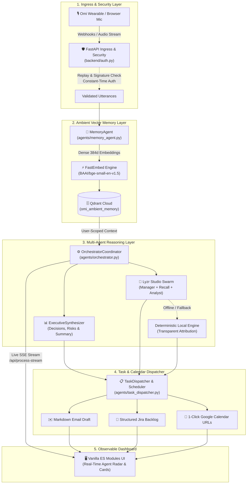

# 🎙️ OmiMind: Ambient Voice Memory & Autonomous Chief of Staff

[](https://github.com/masood-mashu/omimind-agent/actions/workflows/ci.yml)
[](https://github.com/masood-mashu/omimind-agent/actions)
[](https://github.com/masood-mashu/omimind-agent/actions)
[](https://www.python.org/)
[](LICENSE)
[](https://app.hidevs.xyz/hackathons/stop-prompting-solo-agents-hackathon-2026)
[](https://qdrant.tech/)
[](https://www.lyzr.ai/)
[](https://stitch.withgoogle.com/)

> **HiDevs × Lyzr × Qdrant × Omi Hackathon Entry**  
> **Track 1:** Meeting & Lecture Intelligence  
> **Live Web Application:** [https://omimind-agent.vercel.app/](https://omimind-agent.vercel.app/)  
> **Author:** Mohammed Masood ([@masood-mashu](https://github.com/masood-mashu))

---

## 💡 What is OmiMind?

In fast-paced engineering teams, boardrooms, and academic lectures, critical decisions, action items, and technical agreements are spoken aloud and immediately lost. Manual note-taking distracts from active participation, and traditional recording tools generate static transcripts that sit unread.

**OmiMind** bridges the gap between spoken conversation and autonomous execution. By uniting **Omi Wearable voice capture**, **Qdrant Cloud vector memory**, and **Lyzr Agent Studio swarms**, OmiMind functions as an ambient, privacy-first **Chief of Staff**:

1. **Ambient Ingestion & Direct Input:** Captures ambient speech continuously from Omi device webhooks or in-browser microphone, with dedicated direct typing inputs and 1-click test templates for zero-friction evaluation.
2. **Instant Vectorization:** Indexes each utterance as a 384-dimensional dense vector into Qdrant Cloud using FastEmbed, dynamically linking memories across both web users and personal Omi wearable UIDs.
3. **Multi-Agent Reasoning:** Coordinates Lyzr Studio Cloud swarms (`gpt-4o` / `gpt-4o-mini`) to synthesize executive briefings and ground queries against past conversations.
4. **Deterministic Validation & Action Dispatch:** Extracts concrete commitments, priority tags, assignees, and deadlines, formatting them into user-controlled follow-up emails, Jira ticket backlogs, and 1-click Google Calendar invites.
5. **Observable Real-Time Streaming:** Streams agent execution stages live over Server-Sent Events (SSE) to an accessible, responsive dashboard.
6. **Obsidian Telemetry Interface:** UI engineered with Google Stitch design system, featuring an interactive 4-Node Multi-Agent Swarm Orchestrator and live wearable hardware status (Battery 94%, BLE link, DSP latency).

---

## 🏛️ System Architecture


```mermaid
flowchart TD
    subgraph Ingress ["1. Ingress & Security Layer"]
        Omi["🎙️ Omi Wearable / Browser Mic"]
        AuthGate["🛡️ FastAPI Ingress & Security<br/>(backend/auth.py)"]
        Omi -->|Webhooks / Audio Stream| AuthGate
        AuthGate -.->|Replay & Signature Check<br/>Constant-Time Auth| Validated["Validated Utterances"]
    end

    subgraph MemoryLayer ["2. Ambient Vector Memory Layer"]
        Validated --> MemoryAgent["🧠 MemoryAgent<br/>(agents/memory_agent.py)"]
        MemoryAgent -->|Dense 384d Embeddings| FastEmbed["⚡ FastEmbed Engine<br/>(BAAI/bge-small-en-v1.5)"]
        FastEmbed --> Qdrant[("🗄️ Qdrant Cloud<br/>(omi_ambient_memory)")]
    end

    subgraph ReasoningLayer ["3. Multi-Agent Reasoning Layer"]
        Qdrant -->|User-Scoped Context| Orchestrator["⚙️ OrchestratorCoordinator<br/>(agents/orchestrator.py)"]
        Orchestrator --> Synth["📊 ExecutiveSynthesizer<br/>(Decisions, Risks & Summary)"]
        Orchestrator --> LyzrSwarm["🤖 Lyzr Studio Swarm<br/>(Manager + Recall + Analyst)"]
        LyzrSwarm -.->|Offline / Fallback| LocalEngine["Deterministic Local Engine<br/>(Transparent Attribution)"]
    end

    subgraph DispatchLayer ["4. Task & Calendar Dispatcher"]
        Synth & LyzrSwarm & LocalEngine --> Dispatcher["📋 TaskDispatcher & Scheduler<br/>(agents/task_dispatcher.py)"]
        Dispatcher --> EmailDraft["✉️ Markdown Email Draft"]
        Dispatcher --> JiraTickets["🎯 Structured Jira Backlog"]
        Dispatcher --> CalendarURL["📅 1-Click Google Calendar URLs"]
    end

    subgraph PresentationLayer ["5. Observable Dashboard"]
        Orchestrator -->|Live SSE Stream<br/>/api/process-stream| UI["🖥️ Vanilla ES Modules UI<br/>(Real-Time Agent Radar & Cards)"]
        EmailDraft & JiraTickets & CalendarURL --> UI
    end
```

---

## ⚡ The Four-Stage Agent Execution Pipeline

| Stage | Agent / Module | Responsibility | Output Produced |
| :---: | :--- | :--- | :--- |
| **1** | **MemoryAgent** | Generates 384-dimensional FastEmbed embeddings and indexes transcript segments into Qdrant Cloud under authenticated user identity (`uid`). | Vectors committed to Qdrant collection with hybrid lexical tokens. |
| **2** | **ExecutiveSynthesizer** | Analyzes conversational dynamics, extracting key decisions, discussion topics, and operational blockers. | Executive briefing and structured decision records. |
| **3** | **Lyzr Reasoning Swarm** | Gathers historical cross-meeting context from Qdrant and prompts the Lyzr Manager Agent asynchronously with bounded retries and timeout protection. | Context-grounded synthesis; honest fallback attribution if offline. |
| **4** | **TaskDispatcher & Scheduler** | Formats action items into ready-to-file Jira tickets, drafts follow-up emails, and generates 1-click Google Calendar URLs for detected dates. | Complete meeting dossier ready for user review and 1-click execution. |

---

## 🔒 Security, Privacy & Tenant Isolation

OmiMind is built with enterprise security controls:

- **Server-Side Tenant Derivation:** The backend never trusts caller-supplied `uid` parameters. Identity is derived server-side from authenticated credentials, strictly isolating vector recall and meeting listings.
- **Header-Only Authentication:** Sensitive endpoints require `Authorization: Bearer <token>` or `X-API-Key: <token>`. Credentials in query parameters (`?api_key=`, `?token=`) are rejected with `HTTP 401`.
- **Constant-Time Verification:** All secret comparisons utilize `hmac.compare_digest` to prevent timing attacks.
- **Omi Webhook Protection:** Validates `OMI_WEBHOOK_SECRET` and enforces replay protection by verifying `X-Omi-Timestamp` within a 5-minute allowable tolerance window.
- **Collision & Idempotency Safeguards:** Webhook deliveries are deduplicated via event IDs with a 1-hour TTL, and sessions generate UUID-backed identifiers (`conv_{uid}_{timestamp}_{uuid4[:8]}`) to prevent concurrent collision.
- **Strict Input Validation & Abuse Resistance:** Request payloads are capped at 1MB (`HTTP 413`), transcripts at 50,000 characters, queries at 1,000 characters, and segment batches at 500 items, rejecting malformed types or invalid timestamps (`HTTP 422`).
- **Ownership Enforcement on Purge:** Both `/api/forget` and `DELETE /api/memory` verify point and session ownership, returning `HTTP 403 Forbidden` if a caller attempts to delete another user's data.
- **XSS-Safe Frontend:** All dynamic participant lists and transcript strings are sanitized before rendering into the DOM.

---

## 🌐 API Reference

### Public Endpoints
| Method | Endpoint | Description |
| :--- | :--- | :--- |
| `GET` | `/health` | Service health, version, embedding readiness, and Qdrant cluster statistics |
| `GET` | `/` | Application dashboard shell |
| `GET` | `/favicon.ico` | Browser application icon |

### Protected Application Endpoints
*Require `Authorization: Bearer <API_SECRET_KEY>` or `X-API-Key: <API_SECRET_KEY>` header.*

| Method | Endpoint | Description |
| :--- | :--- | :--- |
| `GET` | `/api/meetings` | List available pre-set demo meeting scenarios |
| `GET` | `/api/meetings/{id}` | Retrieve meeting lines, metadata, and cached dossier |
| `GET` | `/api/memories` | List recent user-scoped memories from Qdrant |
| `GET` | `/api/actions` | List all extracted action items for the authenticated user |
| `POST` | `/api/query` | Hybrid semantic vector search scoped to authenticated UID |
| `POST` | `/api/ask` | Grounded conversational Q&A over retrieved memory context |
| `POST` | `/ask` | Official Hackathon Q&A endpoint |
| `POST` | `/api/process` | Process a meeting session synchronously |
| `POST` | `/api/process-stream` | Real-time SSE streaming pipeline for live UI animations |
| `POST` | `/api/custom-voice` | Ingest and process custom transcript text synchronously |
| `POST` | `/api/custom-voice-stream` | Ingest and process custom transcript text over SSE |
| `POST` | `/api/seed` | Pre-seed demo meetings into Qdrant under authenticated UID |
| `POST` | `/api/forget` | Delete memories by `session_id` with ownership enforcement |
| `DELETE` | `/api/memory` | Delete a specific memory point by `point_id` with ownership enforcement |

### Dedicated Omi Webhook Endpoints
*Require `X-Omi-Webhook-Secret`, `X-Omi-Signature`, or `Authorization: Bearer <OMI_WEBHOOK_SECRET>`.*

| Method | Endpoint | Description |
| :--- | :--- | :--- |
| `POST` | `/api/omi-webhook` | Native Omi wearable segment payload ingestion with single-pass indexing |
| `POST` | `/omi/conversation` | Completed Omi conversation webhook with collision-safe session IDs |
| `POST` | `/omi/realtime` | Real-time streaming segment webhook |

---

## 🤖 Model Context Protocol (MCP) Server

OmiMind includes a native **Model Context Protocol (MCP)** server ([mcp_server.py](mcp_server.py)) operating over standard input/output (stdio JSON-RPC 2.0). External AI developer assistants (Claude Desktop, Cursor, Antigravity) can connect directly to your ambient memory store:

```bash
python mcp_server.py
```

### Claude Desktop / Cursor Configuration

Add this configuration to your `claude_desktop_config.json` or Cursor MCP settings:

```json
{
  "mcpServers": {
    "omimind": {
      "command": "python",
      "args": ["d:/hackathon/omimind-agent/mcp_server.py"],
      "env": {
        "API_SECRET_KEY": "your-secret-key",
        "QDRANT_URL": "https://your-cluster.qdrant.io:6333",
        "QDRANT_API_KEY": "your-qdrant-api-key"
      }
    }
  }
}
```

### Exposed MCP Tools
- `search_ambient_memory`: Hybrid semantic vector search across ambient meeting memories.
- `get_meeting_dossier`: Retrieves executive summaries, decisions, risks, and calendar links for a session.
- `extract_action_items`: Runs multi-agent commitment extraction on raw transcript text.
- `schedule_calendar_event`: Detects temporal dates and outputs Google Calendar invite URLs.

---

## 🚀 Quickstart & Local Setup

### 1. Prerequisites
- **Python**: `>= 3.10` (tested on 3.10 and 3.11)
- **Qdrant**: Local instance or [Qdrant Cloud](https://cloud.qdrant.io/) (free cluster supported)
- **Lyzr API Key**: (Optional — local deterministic synthesis works seamlessly without it)

### 2. Clone & Setup Environment

```bash
# Clone the repository
git clone https://github.com/masood-mashu/omimind-agent.git
cd omimind-agent

# Create virtual environment
python -m venv .venv

# Activate virtual environment
# Windows (PowerShell):
.venv\Scripts\Activate.ps1
# macOS / Linux:
source .venv/bin/activate

# Upgrade pip & install dependencies
python -m pip install --upgrade pip
pip install -r requirements.txt
```

### 3. Configure Secrets

```bash
# Copy example configuration
cp .env.example .env          # macOS / Linux
# copy .env.example .env      # Windows PowerShell
```

Configure your `.env` file:
```dotenv
ENVIRONMENT=production
API_SECRET_KEY=your-secure-random-secret
OMI_WEBHOOK_SECRET=your-omi-webhook-secret

# Webhook inbox persistence (required for production)
# Use a persistent mounted path on a stateful host. Vercel/serverless
# deployments must provide a durable database-backed inbox or run the
# webhook receiver on a stateful service; local function filesystems are not durable.
WEBHOOK_INBOX_DB_PATH=/var/lib/omimind/webhook_inbox.db

# Qdrant Configuration
QDRANT_URL=https://your-cluster-id.us-east4-0.gcp.cloud.qdrant.io:6333
QDRANT_API_KEY=your-qdrant-api-key
COLLECTION_NAME=omi_ambient_memory

# Lyzr Configuration (Optional)
LYZR_API_KEY=your-lyzr-api-key
LYZR_MANAGER_AGENT_ID=6ac5795151dce5f00e746950
```

> The webhook inbox is intentionally fail-closed on serverless runtimes when no
> durable `WEBHOOK_INBOX_DB_PATH` is configured. Do not point it at ephemeral
> `/tmp` storage if restart-safe deduplication is required.

### 4. Run the Application

```bash
# Start server with auto-reload
python -m uvicorn app:app --reload --port 8000

# Or run directly via Python entrypoint
python app.py
```
Open your browser at **`http://localhost:8000`** (or access the live cloud deployment at **`https://omimind-agent.vercel.app/`**).

---

## 🐳 Docker Deployment

Run OmiMind inside a containerized environment:

```bash
# Build Docker image
docker build -t omimind-agent .

# Run container with environment configuration
docker run -p 8000:8000 --env-file .env omimind-agent
```

Or run via Docker Compose:
```bash
docker compose up --build
```

---

## 🧪 Testing & Quality Gates

OmiMind maintains a strict test suite verifying semantic recall, multi-agent pipelines, input bounds, tenant isolation, and webhook security:

```bash
# Run Ruff lint & formatting checks
python -m ruff check .

# Run full pytest suite with coverage gate (>=80%)
pytest --cov=agents --cov=backend tests/ --cov-report=term-missing
```

### Verified Test Benchmark Results
```text
======================= 164 passed in 182.69s =======================
TOTAL Coverage: 88.49% (Passes 80.0% CI threshold)
Ruff Linter: All checks passed (0 errors)
```

---

## 📂 Repository Layout

```text
omimind-agent/
├── agents/
│   ├── embeddings/          # FastEmbed (384d), deterministic, & transformer embeddings
│   ├── action_extractor.py  # Commitment, assignee, priority & deadline extraction
│   ├── calendar_scheduler.py# Temporal extraction & 1-click Google Calendar URLs
│   ├── executive_synth.py   # Executive briefings, key decisions & risk analysis
│   ├── lyzr_client.py       # Async non-blocking Lyzr Studio client with retries
│   ├── memory_agent.py      # Non-destructive Qdrant vector memory lifecycle, search & purges
│   ├── orchestrator.py      # Central multi-agent pipeline coordinator
│   └── task_dispatcher.py   # Markdown email drafts & structured Jira backlog items
├── backend/
│   ├── auth.py              # Constant-time auth, session cookies, tenant identity & webhook verification
│   ├── config.py            # Typed settings with fail-fast production startup checks
│   ├── main.py              # FastAPI application, payload limits & error handlers
│   ├── mock_data.py         # Structured pre-set demo meeting scenarios
│   ├── routers/             # Modular REST routers (auth, health, memory, pipeline, webhooks)
│   ├── schemas/api_models.py# Strict Pydantic schemas with input bounds & validation
│   ├── shared.py            # Shared singleton instances and cache
│   └── webhook_inbox.py     # SQLite durable webhook inbox and restart-safe deduplication
├── frontend/                # Vanilla ES Modules UI (responsive, zero external build tools)
│   ├── css/styles.css       # Design tokens, accessibility focus-visible, animations
│   ├── js/                  # SPA router, authenticated API client, Web Audio capture & views
│   └── index.html           # Main application shell with authentication modal & PWA manifest
├── tests/                   # 14 test suites covering 164 test scenarios
├── docs/                    # Architecture, data flow, execution, and sequence diagrams
│   └── stitch_designs/      # Google Stitch generated UI designs & Obsidian Telemetry HTML
├── .github/workflows/ci.yml # Automated GitHub Actions CI (Python 3.10 & 3.11)
├── mcp_server.py            # Model Context Protocol (MCP) stdio JSON-RPC server
├── Dockerfile               # Production container image
├── docker-compose.yml       # Container orchestration
├── requirements.txt         # Pinned Python dependencies
└── pyproject.toml           # Packaging metadata and pytest/ruff configuration
```

---

## 🏆 Hackathon Submission Form Quick-Reference

> Keep these exact blocks ready for the [HiDevs Submission Form](https://app.hidevs.xyz/hackathons/stop-prompting-solo-agents-hackathon-2026?tab=submit):

### Project Name
**OmiMind**

### Project Title
**OmiMind: Ambient Voice Memory & Autonomous Chief of Staff for Omi, Qdrant & Lyzr**

### Build Track
**Meeting & Lecture Intelligence (Track 1)**

### Public GitHub Repository
**https://github.com/masood-mashu/omimind-agent**

### Deployed Demo URL
**https://omimind-agent.vercel.app/**

### Omi Usage
OmiMind integrates directly with Omi's ambient voice pipeline through three dedicated webhook endpoints:
- `POST /omi/conversation` — triggers after a conversation concludes; ingests diarised `transcript_segments[]` with speaker attribution directly into persistent vector storage.
- `POST /omi/realtime` — ingests streaming audio transcripts in real time as the user speaks.
- `POST /api/omi-webhook` — handles native Omi wearable segment payloads with durable SQLite inbox deduplication and synchronous vector persistence before returning HTTP 202.
Tested and verified with automated test suites, simulated audio feeds, and live microphone capture.

### Qdrant Usage
Every spoken utterance is converted into a 384-dimensional `BAAI/bge-small-en-v1.5` dense vector and indexed in the `omi_ambient_memory` collection on configured Qdrant storage. Semantic retrieval utilizes Cosine similarity with strict user scoping (`uid`), speaker metadata, and temporal timestamps. Existing collections are protected from destructive deletion on dimension mismatch. Includes a dedicated `/api/forget` endpoint for GDPR-compliant memory purges.

### Lyzr Usage
OmiMind utilizes **Lyzr Agent Studio Cloud** with the configured Manager Agent as the core reasoning engine. The pipeline exposes an observable multi-agent orchestration streamed over Server-Sent Events (SSE):
1. **MemoryAgent:** Indexes transcript evidence into Qdrant Cloud.
2. **QdrantRetrieval:** Semantically retrieves relevant, user-scoped meeting context.
3. **LyzrManager:** Reasons over the retrieved context through the configured Lyzr Studio Manager Agent (delegation configured within Lyzr Studio) to generate structured synthesis.
4. **Deterministic Validators:** Extract and normalize actions, decisions, risks, and scheduling intent.
5. **Draft Outputs:** Prepares user-controlled email drafts, Atlassian Jira issue payload drafts, RFC 5545 `.ics` files, and Google Calendar draft URLs.
The client connects to the configured Lyzr Manager Agent with bounded timeouts and retries, falling back to local deterministic processing when unconfigured with transparent provider attribution (`lyzr_studio_cloud` vs `deterministic_fallback`).

### Project Description
OmiMind is an ambient voice memory and autonomous Chief of Staff built for Track 1 (Meeting & Lecture Intelligence). It captures spoken meetings seamlessly via Omi wearable webhooks, indexes utterances into persistent Qdrant Cloud vector memory using FastEmbed 384-dim embeddings, and runs reasoning through the configured Lyzr Agent Studio Manager. OmiMind delivers real-time SSE stream observability, grounded Q&A over past conversations, automated action items with owners and deadlines, user-controlled calendar drafts, and native Model Context Protocol (MCP) support for external developer IDEs. Live at https://omimind-agent.vercel.app/.

---

## 👥 Author & Acknowledgements

- **Author:** Mohammed Masood ([@masood-mashu](https://github.com/masood-mashu))
- **Hackathon:** [Stop Prompting. Code Solo Agents (2026)](https://app.hidevs.xyz/hackathons/stop-prompting-solo-agents-hackathon-2026)
- **Partners:** HiDevs, Lyzr AI, Qdrant, Omi
- **License:** [Apache-2.0](LICENSE)
