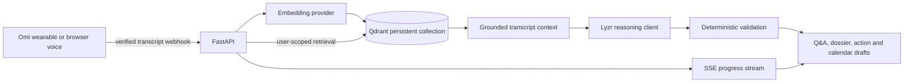

# OmiMind

Ambient voice memory and meeting intelligence built for the HiDevs × Lyzr × Qdrant × Omi hackathon.

OmiMind turns spoken conversations into searchable, user-scoped memory. It combines:

1. Omi voice/transcript ingestion.
2. Qdrant vector storage and semantic retrieval.
3. Lyzr reasoning over retrieved evidence.
4. Deterministic validation for actions, decisions, deadlines, and calendar data.

The selected hackathon track is **Track 1: Meeting & Lecture Intelligence**.

> Status note: this README describes the current working tree. The public deployment and GitHub repository must be redeployed/pushed after the current security hardening changes are committed. Do not treat the hosted demo as proof that every local change is deployed.

> Integration note: the hardened backend now requires authentication headers on application routes. The current browser API client does not yet inject those headers, so local protected UI flows need that credential plumbing before they can be considered release-ready.

## What it does

- Captures transcript segments from Omi webhooks or browser voice input.
- Stores utterances as 384-dimensional embeddings in the configured Qdrant collection.
- Retrieves memories using semantic and lexical signals, scoped to the authenticated user.
- Sends retrieved context to Lyzr when configured.
- Labels Lyzr, deterministic fallback, unconfigured, and error paths separately.
- Extracts action items, assignees, priorities, deadlines, decisions, and risks.
- Streams pipeline progress over Server-Sent Events (SSE).
- Provides grounded Q&A with supporting memories and relevance scores.
- Supports memory deletion by session or point ID with ownership checks.
- Exposes optional MCP tools for external developer assistants.

OmiMind is designed for meeting notes, lectures, project discussions, incident reviews, and follow-up planning. It does not autonomously send email, create tickets, or modify calendars; those outputs are prepared for user review.

## Architecture


```mermaid
flowchart LR
    Omi[Omi wearable or browser voice] -->|verified transcript webhook| API[FastAPI]
    API --> Embed[Embedding provider]
    Embed --> Qdrant[(Qdrant persistent collection)]
    API -->|user-scoped retrieval| Qdrant
    Qdrant --> Context[Grounded transcript context]
    Context --> Lyzr[Lyzr reasoning client]
    Lyzr --> Validate[Deterministic validation]
    Validate --> UI[Q&A, dossier, action and calendar drafts]
    API --> SSE[SSE progress stream]
    SSE --> UI
```

### Main execution loop

```text
Omi transcript
  -> FastAPI validation and authentication
  -> embedding generation
  -> Qdrant indexing
  -> user-scoped semantic retrieval
  -> Lyzr reasoning when configured
  -> deterministic normalization and validation
  -> grounded answer, dossier, or user-controlled draft output
```

The implementation is intentionally kept as a Vanilla ES Modules frontend and a FastAPI backend. There is no frontend framework migration or separate orchestration service.

## Repository layout

```text
omimind-agent/
├── agents/
│   ├── embeddings/          Embedding provider implementations
│   ├── action_extractor.py  Commitment, owner, priority, and deadline extraction
│   ├── calendar_scheduler.py RFC 5545 calendar event generation
│   ├── executive_synth.py   Deterministic briefing and risk synthesis
│   ├── lyzr_client.py       Lyzr HTTP client and provider attribution
│   ├── memory_agent.py      Qdrant lifecycle, indexing, search, and deletion
│   ├── orchestrator.py      End-to-end processing and reconciliation
│   └── task_dispatcher.py   Email and issue draft generation
├── backend/
│   ├── auth.py              Header authentication and Omi webhook verification
│   ├── config.py            Typed settings and production validation
│   ├── main.py              FastAPI application and middleware
│   ├── routers/             Health, memory, pipeline, and webhook routes
│   ├── schemas/             Pydantic request and response models
│   └── shared.py            Shared application state and processed dossiers
├── frontend/                Vanilla ES Modules user interface
├── tests/                   Unit, integration, endpoint, and hardening tests
├── docs/                    Architecture, data flow, sequence, and demo notes
├── mcp_server.py            Optional MCP JSON-RPC server
├── app.py                   Local Uvicorn entrypoint
├── api/index.py             Vercel Python entrypoint
├── Dockerfile
├── docker-compose.yml
├── .env.example
└── pyproject.toml
```

## Quick start

### Requirements

- Python 3.10 or newer.
- A Qdrant instance for production mode.
- An `API_SECRET_KEY` for protected application routes.
- An `OMI_WEBHOOK_SECRET` for Omi webhook verification.
- Lyzr credentials if cloud reasoning is required.

### Install

```bash
git clone https://github.com/masood-mashu/omimind-agent.git
cd omimind-agent

python -m venv .venv

# Windows PowerShell
.venv\Scripts\Activate.ps1

# macOS/Linux
# source .venv/bin/activate

python -m pip install --upgrade pip
pip install -r requirements.txt
```

### Configure

```bash
copy .env.example .env          # Windows
# cp .env.example .env          # macOS/Linux
```

At minimum, production mode requires:

```dotenv
ENVIRONMENT=production
API_SECRET_KEY=replace-with-a-long-random-secret
QDRANT_URL=https://your-cluster.qdrant.io:6333
OMI_WEBHOOK_SECRET=replace-with-your-omi-webhook-secret
```

For Lyzr cloud reasoning, also configure:

```dotenv
LYZR_API_KEY=...
LYZR_AGENT_ID=...
# Optional manager agent
LYZR_MANAGER_AGENT_ID=...
```

For local deterministic testing, use `ENVIRONMENT=test` or configure a test environment explicitly. Do not use test-mode identity behavior in production.

### Run

```bash
python -m uvicorn app:app --reload --port 8000
```

Open <http://localhost:8000>.

The server validates required production configuration during startup. A production process without persistent Qdrant, API authentication, or the Omi webhook secret is expected to fail fast.

## Authentication and privacy

Sensitive application endpoints require one of these headers:

```http
Authorization: Bearer YOUR_API_SECRET_KEY
```

or:

```http
X-API-Key: YOUR_API_SECRET_KEY
```

Credentials in query parameters are rejected. Caller-supplied `uid` values are not trusted for identity; the server derives the authenticated identity from the configured secret.

Omi webhook requests additionally require:

- `OMI_WEBHOOK_SECRET` configured server-side.
- A fresh `X-Omi-Timestamp` header within the allowed replay window.
- Either the configured webhook secret or an HMAC `X-Omi-Signature` over `timestamp.body`.

Memory search, listing, processing, dossier access, and deletion are user-scoped. Deletion of another user's session or point is rejected.

Do not commit `.env` files, provider credentials, personal transcripts, or real meeting data. Use synthetic fixtures for demos and tests.

## API reference

### Public endpoints

| Method | Endpoint | Purpose |
|---|---|---|
| `GET` | `/health` | Service and dependency health status |
| `GET` | `/favicon.ico` | Browser icon |
| `GET` | `/favicon.svg` | Browser icon |
| `GET` | `/` | Frontend shell |

### Protected application endpoints

All endpoints below require `Authorization: Bearer ...` or `X-API-Key: ...`.

| Method | Endpoint | Purpose |
|---|---|---|
| `GET` | `/api/meetings` | List available meeting fixtures |
| `GET` | `/api/meetings/{meeting_id}` | Retrieve a meeting fixture or dossier |
| `GET` | `/api/memories` | List user-scoped memories |
| `GET` | `/api/actions` | List user-scoped extracted actions |
| `POST` | `/api/query` | Semantic memory search |
| `POST` | `/api/ask` | Grounded Q&A over retrieved memories |
| `POST` | `/ask` | Official grounded Q&A endpoint |
| `POST` | `/api/process` | Process a meeting synchronously |
| `POST` | `/api/process-stream` | Process a meeting with SSE progress |
| `POST` | `/api/custom-voice` | Process a custom transcript synchronously |
| `POST` | `/api/custom-voice-stream` | Process a custom transcript with SSE |
| `POST` | `/api/seed` | Seed configured demo data |
| `POST` | `/api/forget` | Delete memory by session or point ID |
| `DELETE` | `/api/memory` | Delete memory by point or session |

### Omi webhook endpoints

These endpoints use the dedicated Omi webhook verification rules described above.

| Method | Endpoint | Purpose |
|---|---|---|
| `POST` | `/api/omi-webhook` | Native Omi segment ingestion |
| `POST` | `/omi/conversation` | Completed conversation ingestion |
| `POST` | `/omi/realtime` | Realtime transcript ingestion |

Example authenticated Q&A request:

```bash
curl -X POST http://localhost:8000/ask \
  -H "Authorization: Bearer $API_SECRET_KEY" \
  -H "Content-Type: application/json" \
  -d '{"question":"What deadline did I mention?","limit":5}'
```

The response includes the answer, supporting memory records, relevance information, and the actual provider attribution when available.

## Omi, Qdrant, and Lyzr integration

### Omi

Omi sends transcript segments to the webhook layer. The backend validates payload shape and size, verifies credentials and replay timestamps, derives the authenticated user identity, and indexes accepted utterances exactly once per event.

### Qdrant

Each accepted utterance stores text plus metadata such as:

- authenticated user ID,
- session ID,
- speaker,
- timestamp,
- topic,
- source and ingestion metadata.

The default collection is `omi_ambient_memory`. The production configuration requires a persistent Qdrant URL; silent ephemeral fallback is not allowed in production.

### Lyzr

When configured, retrieved memories and the user's request are sent to the configured Lyzr inference endpoint. The client uses bounded retries for server errors, timeouts, credential redaction, and an asynchronous path for streaming workflows.

The application distinguishes these result providers:

- `lyzr_studio_cloud`
- `deterministic_fallback`
- `unconfigured`
- `lyzr_error`

This prevents a local deterministic answer from being presented as a verified cloud-agent response.

## Demo flow

For a reliable demo, use synthetic content:

1. Ingest a short Omi-style transcript containing a project name, deadline, owner, and decision.
2. Confirm the utterances appear in Qdrant memory.
3. Ask a question that requires semantic recall rather than exact keyword matching.
4. Show the supporting memories and relevance scores.
5. Process a meeting through `/api/process-stream`.
6. Show the SSE stages: indexing, retrieval, reasoning, validation, and output preparation.
7. Review generated actions and calendar drafts.
8. Delete the test session and confirm the memory is no longer retrievable.

See [`docs/DEMO_SCRIPT.md`](docs/DEMO_SCRIPT.md) for the longer walkthrough. A public deployment should only be advertised after verifying that it runs the same commit as this repository and that its secrets and persistent Qdrant configuration are present.

## Optional MCP server

Run:

```bash
python mcp_server.py
```

The server exposes JSON-RPC tools for searching ambient memory, retrieving meeting dossiers, extracting action items, and generating follow-up calendar events.

Example client configuration:

```json
{
  "mcpServers": {
    "omimind": {
      "command": "python",
      "args": ["/absolute/path/to/omimind-agent/mcp_server.py"]
    }
  }
}
```

## Configuration reference

| Variable | Purpose | Production guidance |
|---|---|---|
| `ENVIRONMENT` | Runtime mode | Use `production` outside tests |
| `API_SECRET_KEY` | Application authentication | Required |
| `OMI_WEBHOOK_SECRET` | Omi webhook authentication | Required |
| `QDRANT_URL` | Persistent Qdrant endpoint | Required |
| `QDRANT_API_KEY` | Qdrant cloud credential | Required when the cluster needs it |
| `COLLECTION_NAME` | Qdrant collection | Defaults to `omi_ambient_memory` |
| `LYZR_API_KEY` | Lyzr credential | Required for cloud reasoning |
| `LYZR_AGENT_ID` | Lyzr agent ID | Required for the selected agent flow |
| `LYZR_MANAGER_AGENT_ID` | Optional manager agent ID | Use when hierarchical orchestration is configured |
| `EMBEDDING_PROVIDER` | `fastembed`, `deterministic`, or `sentence_transformers` | Use FastEmbed for production semantic embeddings |
| `ALLOW_EPHEMERAL_MEMORY` | Local fallback behavior | Do not rely on it for production persistence |
| `ALLOWED_ORIGINS` | CORS allow-list | Set explicitly for deployment |
| `PORT` | HTTP port | Defaults to `8000` |

See [`.env.example`](.env.example) for the complete template.

## Docker

```bash
docker build -t omimind-agent .
docker run --env-file .env -p 8000:8000 omimind-agent
```

Before using Docker Compose, ensure the compose environment passes every production variable required by `backend/config.py`, especially `QDRANT_URL`, `API_SECRET_KEY`, and `OMI_WEBHOOK_SECRET`.

## Testing and verification

Run the static checks:

```bash
python -m ruff check .
python -m compileall -q backend agents api
git diff --check
```

Run the test suite:

```bash
python -m pytest --cov=agents --cov=backend
```

Current working-tree verification recorded during the latest audit:

- Ruff: passed.
- Python compilation: passed.
- Diff whitespace check: passed.
- Focused agent and orchestration tests: 31 passed.
- Test collection: 140 tests collected.
- Full suite and security suite: not marked as passing until the API test stall is diagnosed and reproduced cleanly.

Do not update the test or coverage badges with a new number unless the result was produced from the current commit in a clean environment.

## Documentation

- [`docs/ARCHITECTURE.md`](docs/ARCHITECTURE.md) — component responsibilities and system structure.
- [`docs/DATA_FLOW.md`](docs/DATA_FLOW.md) — transcript, memory, and output lifecycle.
- [`docs/EXECUTION_FLOW.md`](docs/EXECUTION_FLOW.md) — processing flow.
- [`docs/SEQUENCE_DIAGRAM.md`](docs/SEQUENCE_DIAGRAM.md) — chronological request sequence.
- [`docs/DEMO_SCRIPT.md`](docs/DEMO_SCRIPT.md) — demo preparation and walkthrough.
- [`docs/TRACK_1_ANALYSIS.md`](docs/TRACK_1_ANALYSIS.md) — Track 1 mapping.
- [`Hackathon-Submission-Guide.pdf`](Hackathon-Submission-Guide.pdf) — submission requirements.

## Contributing

1. Create a focused branch.
2. Keep changes within the existing FastAPI, Qdrant, Lyzr, Omi, and Vanilla ES Modules architecture.
3. Add or update tests for behavior changes.
4. Run Ruff, compilation, focused tests, and the full suite where possible.
5. Do not commit secrets or real conversation data.
6. Update documentation when endpoint behavior, authentication, configuration, or deployment changes.

## License and acknowledgements

OmiMind is released under the [Apache-2.0 license](LICENSE).

Built for the [HiDevs Stop Prompting. Code Solo Agents Hackathon](https://app.hidevs.xyz/hackathons/stop-prompting-solo-agents-hackathon-2026), with Omi, Qdrant, and Lyzr.
