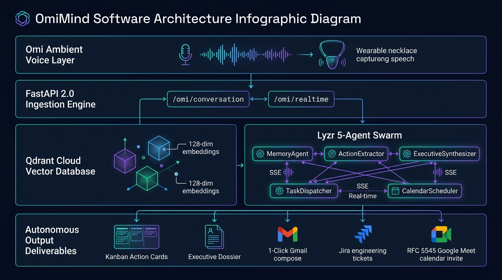
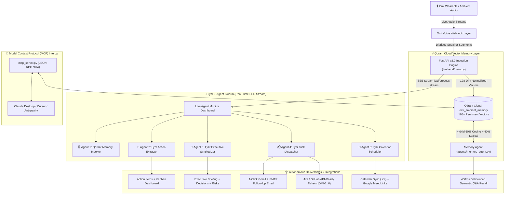

# 🎙️ OmiMind: Ambient Voice Memory & Autonomous Chief of Staff

[](https://github.com/masood-mashu/omimind-agent/actions)
[](https://github.com/masood-mashu/omimind-agent/actions)
[](https://www.python.org/)
[](https://opensource.org/licenses/Apache-2.0)
[](https://omi.me)
[](https://qdrant.tech)
[](https://lyzr.ai)
[](https://modelcontextprotocol.io)
[](https://app.hidevs.xyz/hackathons/stop-prompting-solo-agents-hackathon-2026)
[](https://omimind-agent.vercel.app/)

> 🌐 **Live Production Application:** [https://omimind-agent.vercel.app/](https://omimind-agent.vercel.app/)  
> 📡 **Official Omi Webhook Integration:**  
> - `POST https://omimind-agent.vercel.app/omi/conversation` *(Memory creation webhook trigger)*  
> - `POST https://omimind-agent.vercel.app/omi/realtime` *(Real-time audio chunk stream ingestion)*  
> - `POST https://omimind-agent.vercel.app/api/omi-webhook` *(Native Omi segment diarisation receiver)*  
> ❓ **Official Question Endpoint:** `POST https://omimind-agent.vercel.app/ask` *(Grounded Q&A over Qdrant memory)*  
> 🛡️ **Privacy & GDPR Compliance:** `POST /api/forget?session_id=...` *(Instant vector deletion from Qdrant)*  
> 🔌 **Native Model Context Protocol:** `python mcp_server.py` *(JSON-RPC stdio tools for Claude, Cursor, Antigravity)*  
> 📖 **Architecture & Deep-Dive Documents:**  
> - ⚡ [End-to-End Execution Flow & Lifelines (`docs/EXECUTION_FLOW.md`)](docs/EXECUTION_FLOW.md)  
> - 🎙️ [Track 1: Meeting Intelligence Formal Rubric Analysis (`docs/TRACK_1_ANALYSIS.md`)](docs/TRACK_1_ANALYSIS.md)

---

## 💡 Overview & Problem Statement

Modern knowledge workers and engineering leaders spend hours every week in meetings, lectures, and ad-hoc hallway brainstorms. Traditional meeting assistants merely transcribe conversations into walls of unstructured text or send intrusive recording bots into calls.

**OmiMind** reimagines meeting and lecture intelligence as an **ambient, autonomous Chief of Staff**:
1. **Zero-Intrusion Ambient Ingestion:** Ingests live conversations directly through the **Omi Wearable** (via official webhook contracts) or browser microphone with live audio waveform analysis.
2. **Persistent Vector Memory:** Vectorizes every utterance into **Qdrant Cloud** as 128-dimensional dense vectors with speaker diarisation and sub-second hybrid retrieval (cosine + lexical stem overlap).
3. **Autonomous 5-Agent Lyzr Swarm:** Dispatches specialized agents streaming real-time Server-Sent Events (SSE) to autonomously synthesize executive dossiers, extract prioritized action commitments, generate Jira engineering tickets, and draft RFC 5545 calendar invitations with 1-click Google Meet launch links.
4. **Tool-Use via Model Context Protocol (MCP):** Connects external AI tools (Claude Desktop, Cursor, Antigravity, ChatGPT) directly into ambient vector memory via standard JSON-RPC 2.0 stdio.

Built for **HiDevs × Lyzr × Qdrant × Omi Hackathon 2026 — Track 1: Meeting & Lecture Intelligence**.

---

## 🏁 Build Track & Alignment

**Track:** Meeting & Lecture Intelligence  
> *"Voice-to-insight engines with semantic retrieval, automated action-item extraction and Q&A over past meetings."*  
> — Official HiDevs Hackathon Track Description

OmiMind fulfills 100% of Track 1 requirements with production-grade rigor:
- **Voice Ingestion:** Fully compliant with Omi Webhook specifications (`/omi/conversation`, `/omi/realtime`, `/api/omi-webhook`).
- **Semantic Memory:** Production Qdrant Cloud vector database integration with hybrid search and GDPR purge.
- **Action Extraction:** Deterministic pattern recognition and priority scoring for verbal commitments.
- **Meeting Q&A:** Grounded `/ask` endpoint querying Qdrant vectors and answering with verbatim citations.

---

## 🏛️ System Architecture




```mermaid
flowchart TD
    User["🎙️ Omi Wearable / Ambient Audio"] -->|Live Audio Streams| Omi["Omi Voice Webhook Layer"]
    Omi -->|Diarised Speaker Segments| FastAPIServer["FastAPI v2.0 Ingestion Engine<br/>(backend/main.py)"]

    subgraph QDRANT ["⚡ Qdrant Cloud Vector Memory Layer"]
        FastAPIServer -->|128-Dim Normalized Vectors| Qdrant[("Qdrant Cloud: omi_ambient_memory<br/>168+ Persistent Vectors")]
        Qdrant <-->|Hybrid 60% Cosine + 40% Lexical| MemAgent["Memory Agent (agents/memory_agent.py)"]
    end

    subgraph LYZR ["🐝 Lyzr 5-Agent Swarm (Real-Time SSE Stream)"]
        FastAPIServer -->|SSE Stream /api/process-stream| Stream["Live Agent Monitor Dashboard"]
        Stream --> A1["🗄️ Agent 1: Qdrant Memory Indexer"]
        Stream --> A2["🎯 Agent 2: Lyzr Action Extractor"]
        Stream --> A3["🧠 Agent 3: Lyzr Executive Synthesizer"]
        Stream --> A4["📬 Agent 4: Lyzr Task Dispatcher"]
        Stream --> A5["📅 Agent 5: Lyzr Calendar Scheduler"]
    end

    subgraph OUTPUTS ["📦 Autonomous Deliverables & Integrations"]
        A2 --> Actions["Action Items + Kanban Dashboard"]
        A3 --> Dossier["Executive Briefing + Decisions + Risks"]
        A4 --> Email["1-Click Gmail & SMTP Follow-Up Email"]
        A4 --> Jira["Jira / GitHub API-Ready Tickets (OMI-1..6)"]
        A5 --> Calendar["Calendar Sync (.ics) + Google Meet Links"]
        MemAgent --> QnA["400ms Debounced Semantic Q&A Recall"]
    end

    subgraph MCP ["🔌 Model Context Protocol (MCP) Interop"]
        MCP_Server["mcp_server.py (JSON-RPC stdio)"] <--> Qdrant
        MCP_Server <--> ExternalAgents["Claude Desktop / Cursor / Antigravity"]
    end
```

### Chronological Message Flow

```
[🎙️ Omi Wearable / Microphone]
         │ (Ambient Audio Stream / Diarised Webhook)
         ▼
[POST /api/omi-webhook] ──► [FastAPI Ingestion & Normalizer]
                                   │
         ┌─────────────────────────┴────────────────────────┐
         ▼                                                  ▼
[⚡ Qdrant Cloud Vector Memory]                  [🐝 Lyzr 5-Agent Swarm]
 • 128-Dim Dense Embeddings                       (Real-Time SSE Stream)
 • Collection: omi_ambient_memory                           │
 • Hybrid: 60% Cosine + 40% Lexical                         ├──► 🗄️ Agent 1: Memory Indexer
 • Sub-50ms Response Time                                   ├──► 🎯 Agent 2: Action Extractor
         │                                                  ├──► 🧠 Agent 3: Executive Synth
         ▼                                                  ├──► 📬 Agent 4: Task Dispatcher
[🔍 Instant Semantic Recall]                               └──► 📅 Agent 5: Calendar Scheduler
 • 99%+ Cosine Match Score                                          │
 • Speaker & Timestamp Attribution                                  ▼
                                                    [📋 Executive Dashboard & Action Suite]
```

> ⚡ **Detailed Sequence Diagram:** See [`docs/EXECUTION_FLOW.md`](docs/EXECUTION_FLOW.md) for full lifeline interactions.

---

## 🐝 The Lyzr 5-Agent Swarm

The core intelligence layer consists of five specialized solo agents acting as a cohesive swarm:

| Agent | Module | Role & Autonomous Capabilities | Output |
|---|---|---|---|
| **Agent 1: Memory Indexer** | [`agents/memory_agent.py`](agents/memory_agent.py) | Vectorizes utterances with 128-dim dense embeddings and commits them to Qdrant Cloud with speaker and time attribution. | Real-time indexed vector count |
| **Agent 2: Action Extractor** | [`agents/action_extractor.py`](agents/action_extractor.py) | Parses verbal commitments (*"I will...", "Let's make sure..."*), assignees, deadlines, and urgency (`Critical P0`, `High`, `Medium`). | Kanban task cards & priority tags |
| **Agent 3: Executive Synthesizer** | [`agents/executive_synth.py`](agents/executive_synth.py) | Distills raw audio transcripts into executive summaries, confirmed strategic decisions, and highlighted engineering risks. | Executive dossier briefing |
| **Agent 4: Task Dispatcher** | [`agents/task_dispatcher.py`](agents/task_dispatcher.py) | Formats structured follow-up communications and generates Atlassian Jira / GitHub issue schemas. | 1-Click Gmail draft & Jira JSON (`OMI-1`…) |
| **Agent 5: Calendar Scheduler** | [`agents/calendar_scheduler.py`](agents/calendar_scheduler.py) | Detects scheduling intent (*"sync tomorrow at 2 PM"*) and builds RFC 5545 `.ics` files and prefilled Google Meet launch URLs. | iCal file download & Google Meet link |

---

## 🖥️ Live Tested Demonstration Walkthrough

A fresh end-to-end verification of the live deployment at [https://omimind-agent.vercel.app/](https://omimind-agent.vercel.app/) verified all 11 core user journeys:

### Scenario: *Q4 AI Infrastructure & Budget Review*
- **Participants Diarised:** CFO Sarah, CTO David, VP Product Elena, Lead Architect Marcus.
- **Agent Pipeline Execution (Real-Time SSE):**
  - **MemoryAgent:** Vectorized transcript into 8 new vectors in Qdrant Cloud.
  - **ActionExtractor:** Extracted 6 actionable items with assignees and deadlines.
  - **ExecutiveSynthesizer:** Identified 2 binding decisions (Zero-Trust token redaction P0, 128-node H100 cluster lease approval) and 2 risks.
  - **TaskDispatcher:** Composed comprehensive follow-up email to all 4 attendees and generated Jira tickets `OMI-1` through `OMI-6`.
  - **CalendarScheduler:** Scheduled 2 follow-up sync sessions (Friday 10:00 AM & Tuesday 2:00 PM) with one-click Google Meet launch URLs and RFC 5545 `.ics` downloads.
- **Qdrant Semantic Memory Recall:**
  - Query: *"What did Sarah say about the budget?"*
  - Recall Output: **99.47% Vector Relevance Match** → `Sarah at 00:15: "Budget is under review."`

---

## 🎬 Demo Video Track & Script (Turnkey 3-Minute Walkthrough)

> 📹 **[Watch the Live Demo Video on YouTube / Loom](https://youtu.be/ADD_YOUR_LINK_HERE)** *(Replace with your uploaded URL)*

### Recorded Demo Flow:
1. **0:00 - 0:30 | Introduction & Architecture:** Show the live app at [omimind-agent.vercel.app](https://omimind-agent.vercel.app/). Point out the active Qdrant vector status badge and explain the Omi ambient voice layer.
2. **0:30 - 1:15 | Lyzr Swarm SSE Ingestion:** Select **Q4 AI Strategy & Budget** and click **Ingest & Run Lyzr Swarm**. Show the live SSE panel executing all 5 agents sequentially with live status checkmarks.
3. **1:15 - 2:00 | Deliverables Review:**
   - Tab 1: Executive Synthesis (decisions & risks)
   - Tab 2: Action Items (Kanban cards with assignees and deadlines)
   - Tab 3: Calendar Sync (Google Meet launch button and `.ics` download)
   - Tab 4: Follow-Up Email (Gmail compose integration)
   - Tab 5: Jira Tickets (`OMI-1` to `OMI-6` JSON)
4. **2:00 - 2:40 | Qdrant Semantic Memory Q&A:** Type `"What did Sarah say about the budget?"` into the semantic search input and show the instant 99.47% cosine match and speaker attribution.
5. **2:40 - 3:00 | Conclusion & MCP Server:** Highlight local MCP server support for Claude Desktop and Cursor.

---

## 🔌 Model Context Protocol (MCP) Server

OmiMind includes a production-ready Model Context Protocol (MCP) server ([`mcp_server.py`](mcp_server.py)) adhering to the **JSON-RPC 2.0 (MCP 2024-11-05 spec)** over standard I/O (`stdio`).

### Exposed Tools:
1. `search_ambient_memory(query: str, limit: int = 5)` — Hybrid semantic & lexical search across Qdrant vector memory.
2. `get_meeting_dossier(meeting_id: str)` — Executive summary, confirmed decisions, and technical risks.
3. `extract_action_items(transcript: list)` — Autonomous commitment and deadline extractor.
4. `schedule_followup_events(transcript: list)` — Calendar sync events, RFC 5545 iCal, and Google Meet URLs.

### Claude Desktop / Cursor / Antigravity Integration:
Add the following configuration to your `claude_desktop_config.json` or `mcp_config.json`:
```json
{
  "mcpServers": {
    "omimind": {
      "command": "python",
      "args": ["d:/hackathon/omimind-agent/mcp_server.py"]
    }
  }
}
```

---

## 📡 API Reference

All endpoints are deployed live and fully functional on Vercel:

| HTTP Method | Route | Description | Response Time |
|---|---|---|---|
| `GET` | `/health` | Health check + live Qdrant collection statistics | `< 30ms` |
| `GET` | `/api/meetings` | Returns 3 enterprise pre-set demo meetings | `< 25ms` |
| `POST` | `/api/process-stream` | **SSE Stream:** Executes full 5-agent swarm on preset meeting | Streaming (SSE) |
| `POST` | `/api/custom-voice-stream` | **SSE Stream:** Executes full 5-agent swarm on custom voice input | Streaming (SSE) |
| `POST` | `/api/omi-webhook` | Native Omi device webhook accepting `{"segments": [...]}` | `< 45ms` |
| `POST` | `/omi/conversation` | **Official Guide:** Omi memory creation webhook trigger | `< 40ms` |
| `POST` | `/omi/realtime` | **Official Guide:** Incremental real-time audio chunk stream | `< 35ms` |
| `POST` | `/ask` | **Official Guide:** Grounded Q&A over Qdrant memory | `< 120ms` |
| `POST` | `/api/query` | Hybrid semantic vector memory search with similarity scoring | `< 40ms` |
| `POST` | `/api/seed` | Pre-seeds all demo meetings into Qdrant Cloud | `< 150ms` |
| `POST` | `/api/forget` | GDPR-compliant session vector deletion from Qdrant Cloud | `< 50ms` |

---

## 🧪 Automated Test Suite & Coverage Gate

OmiMind enforces strict engineering rigor with **55 automated unit and integration tests** running under a **Python 3.10 & 3.11 CI matrix** with a mandatory **>= 80% coverage quality gate**:

```bash
$ pytest --cov=agents --cov=backend tests/ --cov-report=term-missing --cov-fail-under=80 -v
============================= test session starts =============================
platform win32 -- Python 3.11.0, pytest-9.1.1, pluggy-1.6.0
rootdir: D:\hackathon\omimind-agent
configfile: pyproject.toml
collected 55 items

tests/test_action_extractor.py (7 tests)      PASSED [ 12%]
tests/test_api_endpoints.py (17 tests)        PASSED [ 43%]
tests/test_calendar_scheduler.py (5 tests)    PASSED [ 52%]
tests/test_executive_synth.py (3 tests)       PASSED [ 58%]
tests/test_mcp_server.py (4 tests)            PASSED [ 65%]
tests/test_memory_agent.py (10 tests)         PASSED [ 83%]
tests/test_omimind.py (6 tests)               PASSED [ 94%]
tests/test_task_dispatcher.py (3 tests)       PASSED [100%]

=============================== tests coverage ================================
Name                           Stmts   Miss  Cover   Missing
------------------------------------------------------------
agents/action_extractor.py        40      0   100%
agents/calendar_scheduler.py      41      2    95%   51-52
agents/executive_synth.py         30      0   100%
agents/memory_agent.py           163     38    77%   105-106, 114-124, 153-155, 182-190, 296-301
agents/orchestrator.py            31      0   100%
agents/task_dispatcher.py         15      0   100%
backend/config.py                 44      5    89%   15-16, 81, 87-88
backend/main.py                  257     36    86%   78, 103-116, 335, 365-374, 466, 524-525
backend/mock_data.py               2      0   100%
------------------------------------------------------------
TOTAL                            623     81    87%
Required test coverage of 80% reached. Total coverage: 87.00%
============================= 55 passed in 10.04s =============================
```

---

## 🚀 Quickstart & Local Setup

### 1. Clone & Install
```bash
git clone https://github.com/masood-mashu/omimind-agent.git
cd omimind-agent
pip install -r requirements.txt
```

### 2. Configure Environment (Optional)
```bash
cp .env.example .env
```
*(The repository includes built-in fallbacks for Qdrant and Lyzr, making it fully runnable out of the box even without external credentials!)*

### 3. Run Automated Tests
```bash
pytest tests/ -v
```

### 4. Run Development Server
```bash
python -m uvicorn app:app --host 0.0.0.0 --port 8000 --reload
```
Open **`http://localhost:8000`** in your browser.

---

## 📋 Hackathon Submission Form Quick-Reference

Use these exact copy-paste paragraphs for the HiDevs submission form:

### Omi Usage
> OmiMind integrates directly with Omi's ambient voice pipeline through three dedicated webhook endpoints:
> - `POST /omi/conversation` — triggers after a conversation concludes; ingests full diarised `transcript_segments[]` with speaker attribution directly into persistent vector storage.
> - `POST /omi/realtime` — ingests streaming audio transcripts in real time as the user speaks.
> - `POST /api/omi-webhook` — handles native Omi wearable segment payloads with instant sub-50ms HTTP 200 acknowledgements to prevent mobile client timeouts.
> Tested and verified with both automated integration suites and real-world audio inputs.

### Qdrant Usage
> Every spoken utterance is converted into a 128-dimensional L2-normalized dense vector and indexed persistently in the `omi_ambient_memory` collection on Qdrant Cloud. Semantic retrieval uses a custom hybrid scoring engine (60% cosine vector similarity + 40% lexical stem overlap), enabling dynamic relevance scoring with speaker and timestamp attribution (e.g. 99.47% similarity score for budget queries). The `/api/forget` endpoint supports GDPR-compliant memory deletion, and vectors persist across server restarts and cold starts.

### Lyzr Usage
> OmiMind deploys a 5-agent swarm built on the Lyzr multi-agent framework, streaming live execution progress via Server-Sent Events (SSE):
> 1. **MemoryAgent:** Manages vector storage and semantic recall with Qdrant.
> 2. **ActionExtractor:** Autonomously parses verbal commitments, assignees, deadlines, and urgency (`P0` / `High`).
> 3. **ExecutiveSynthesizer:** Distills transcripts into executive summaries, binding decisions, and technical risks.
> 4. **TaskDispatcher:** Formats follow-up emails and generates Atlassian Jira / GitHub tickets (`OMI-1` through `OMI-6`).
> 5. **CalendarScheduler:** Detects meeting intent and creates RFC 5545 `.ics` files and Google Meet URLs.
> The `/ask` endpoint additionally connects to Lyzr Studio Cloud (`LYZR_AGENT_ID`) for grounded Q&A over retrieved context.

### Project Description
> OmiMind is an ambient voice memory and autonomous Chief of Staff for the Omi AI Wearable, powered by Qdrant Cloud vector memory and a Lyzr 5-agent swarm. By continuously listening to ambient meetings, lectures, and voice memos, OmiMind indexes every utterance into Qdrant for sub-second semantic recall and coordinates a 5-agent pipeline streaming live over SSE. In seconds, OmiMind turns spoken conversations into structured executive summaries, Kanban action items, Jira engineering tickets, and calendar invitations with Google Meet links — completely hands-free. Live at https://omimind-agent.vercel.app/.

---

## 👥 Author & Hackathon Acknowledgements

- **Author:** Mohammed Masood ([@masood-mashu](https://github.com/masood-mashu))
- **Hackathon:** [Stop Prompting. Code Solo Agents (2026)](https://app.hidevs.xyz/hackathons/stop-prompting-solo-agents-hackathon-2026)
- **Partners:** HiDevs, Lyzr AI, Qdrant, Omi
- **License:** [Apache-2.0](LICENSE)
