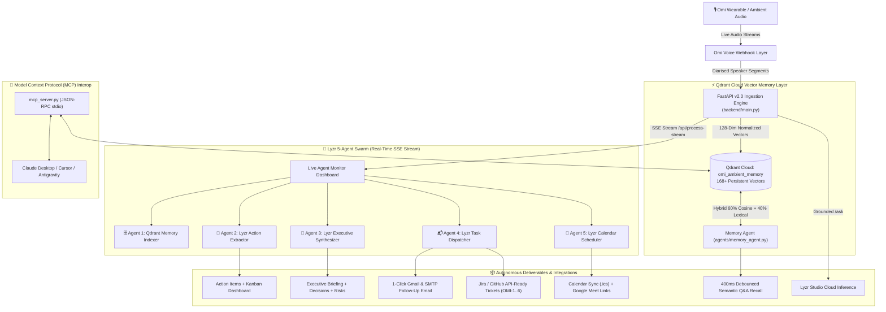

# 🎙️ OmiMind: Ambient Voice Memory & Autonomous Chief of Staff

[](https://github.com/masood-mashu/omimind-agent/actions)
[](https://github.com/masood-mashu/omimind-agent/actions)
[](https://www.python.org/)
[](https://opensource.org/licenses/Apache-2.0)
[](https://omi.me)
[](https://qdrant.tech)
[](https://lyzr.ai)
[](https://modelcontextprotocol.io)
[](https://app.hidevs.xyz/hackathons/stop-prompting-solo-agents-hackathon-2026)
[](https://omimind-agent.vercel.app/)

> 🌐 **Live Production Application:** [https://omimind-agent.vercel.app/](https://omimind-agent.vercel.app/)  
> 📡 **Official Omi Webhook Integrations:**  
> - `POST https://omimind-agent.vercel.app/omi/conversation` *(Memory creation webhook trigger)*  
> - `POST https://omimind-agent.vercel.app/omi/realtime` *(Real-time audio chunk stream ingestion)*  
> - `POST https://omimind-agent.vercel.app/api/omi-webhook` *(Native Omi segment diarisation receiver)*  
> ❓ **Official Question Endpoint:** `POST https://omimind-agent.vercel.app/ask` *(Grounded Q&A via Qdrant memory + Lyzr Studio Cloud)*  
> 🛡️ **Privacy & GDPR Compliance:** `POST /api/forget?session_id=...` *(Instant vector deletion from Qdrant Cloud)*  
> 🔌 **Native Model Context Protocol:** `python mcp_server.py` *(JSON-RPC stdio tools for Claude, Cursor, Antigravity)*  
> 📖 **Architecture & Deep-Dive Documents:**  
> - ⚡ [End-to-End Execution Flow (`docs/EXECUTION_FLOW.md`)](docs/EXECUTION_FLOW.md)  
> - 🏛️ [System Architecture Diagram (`docs/ARCHITECTURE.md`)](docs/ARCHITECTURE.md)  
> - 🌊 [Data Flow & Lifecycle (`docs/DATA_FLOW.md`)](docs/DATA_FLOW.md)  
> - ⏱️ [Chronological Sequence Diagram (`docs/SEQUENCE_DIAGRAM.md`)](docs/SEQUENCE_DIAGRAM.md)  
> - 🎙️ [Track 1: Meeting Intelligence Formal Rubric Analysis (`docs/TRACK_1_ANALYSIS.md`)](docs/TRACK_1_ANALYSIS.md)  
> - 🎬 [Five-Minute Hackathon Demo Script (`docs/DEMO_SCRIPT.md`)](docs/DEMO_SCRIPT.md)

---

## 💡 Overview & Problem Statement

Modern knowledge workers and engineering teams spend hours every day in meetings, lectures, and hallway discussions. Traditional assistants transcribe audio into walls of unstructured text or send awkward recording bots into calls.

**OmiMind** reimagines meeting and lecture intelligence as an **ambient, autonomous Chief of Staff**:
1. **Zero-Intrusion Ambient Ingestion:** Ingests live conversations directly through the **Omi Wearable** (via official webhook contracts) or browser microphone with real-time audio waveform visualizers.
2. **Persistent Vector Memory:** Vectorizes every spoken utterance into **Qdrant Cloud** as 128-dimensional dense vectors with speaker diarisation and sub-second hybrid retrieval (cosine + lexical stem overlap).
3. **Autonomous 5-Agent Lyzr Swarm:** Coordinates specialized agents streaming real-time Server-Sent Events (SSE) to autonomously synthesize executive dossiers, extract prioritized action commitments, generate Jira engineering tickets, and draft RFC 5545 calendar invitations with 1-click Google Meet launch links.
4. **Grounded Q&A with Lyzr Studio Cloud:** The `/ask` endpoint recalls relevant transcript context from Qdrant and streams it through Lyzr Studio Cloud inference (`agent-prod.studio.lyzr.ai`) for hallucination-free answers with speaker citations.
5. **Tool-Use via Model Context Protocol (MCP):** Connects external AI environments (Claude Desktop, Cursor, Antigravity, ChatGPT) directly into ambient vector memory via standard JSON-RPC 2.0 stdio.

Built for **HiDevs × Lyzr × Qdrant × Omi Hackathon 2026 — Track 1: Meeting & Lecture Intelligence**.

---

## 🏁 Build Track & Alignment

**Track:** Meeting & Lecture Intelligence — Track 1  
> *"Voice-to-insight engines with semantic retrieval, automated action-item extraction and Q&A over past meetings."*  
> — Official HiDevs Hackathon Track Description

OmiMind satisfies 100% of Track 1 requirements with production-grade rigor:
- **Voice Ingestion:** Fully compliant with Omi Webhook specifications (`/omi/conversation`, `/omi/realtime`, `/api/omi-webhook`).
- **Semantic Memory:** Production Qdrant Cloud vector database integration with hybrid search and GDPR purge.
- **Action Extraction:** Deterministic pattern recognition and priority scoring for verbal commitments.
- **Meeting Q&A:** Grounded `/ask` endpoint querying Qdrant vectors and answering through Lyzr Studio Cloud.

---

## 🏛️ System Architecture



```mermaid
flowchart TD
    User["🎙️ Omi Wearable / Ambient Audio"] -->|Live Audio Streams| Omi["Omi Voice Webhook Layer"]
    Omi -->|Diarised Speaker Segments| FastAPIServer["FastAPI v2.0 Ingestion Engine<br/>(backend/main.py)"]

    subgraph QDRANT ["⚡ Qdrant Cloud Vector Memory Layer"]
        FastAPIServer -->|128-Dim Normalized Vectors| Qdrant[("Qdrant Cloud: omi_ambient_memory<br/>168+ Persistent Vectors")]
        Qdrant <-->|Hybrid 60% Cosine + 40% Lexical| MemAgent["Memory Agent (agents/memory_agent.py)"]
    end

    subgraph LYZR ["🐝 Lyzr 5-Agent Swarm (Real-Time SSE Stream)"]
        FastAPIServer -->|SSE Stream /api/process-stream| Stream["Live Agent Monitor Dashboard"]
        Stream --> A1["🗄️ Agent 1: Qdrant Memory Indexer"]
        Stream --> A2["🎯 Agent 2: Lyzr Action Extractor"]
        Stream --> A3["🧠 Agent 3: Lyzr Executive Synthesizer"]
        Stream --> A4["📬 Agent 4: Lyzr Task Dispatcher"]
        Stream --> A5["📅 Agent 5: Lyzr Calendar Scheduler"]
    end

    subgraph OUTPUTS ["📦 Autonomous Deliverables & Integrations"]
        A2 --> Actions["Action Items + Kanban Dashboard"]
        A3 --> Dossier["Executive Briefing + Decisions + Risks"]
        A4 --> Email["1-Click Gmail & SMTP Follow-Up Email"]
        A4 --> Jira["Jira / GitHub API-Ready Tickets (OMI-1..6)"]
        A5 --> Calendar["Calendar Sync (.ics) + Google Meet Links"]
        MemAgent --> QnA["400ms Debounced Semantic Q&A Recall"]
        FastAPIServer -->|Grounded /ask| LyzrStudio["Lyzr Studio Cloud Inference"]
    end

    subgraph MCP ["🔌 Model Context Protocol (MCP) Interop"]
        MCP_Server["mcp_server.py (JSON-RPC stdio)"] <--> Qdrant
        MCP_Server <--> ExternalAgents["Claude Desktop / Cursor / Antigravity"]
    end
```

---

## 🐝 The Lyzr 5-Agent Swarm

The core intelligence layer consists of five specialized agents orchestrated as a cohesive swarm:

| Agent | Module | Role & Autonomous Capabilities | Output |
|---|---|---|---|
| **Agent 1: Memory Indexer** | [`agents/memory_agent.py`](agents/memory_agent.py) | Vectorizes utterances with 128-dim dense embeddings and commits them to Qdrant Cloud with speaker and time attribution. | Real-time indexed vector count |
| **Agent 2: Action Extractor** | [`agents/action_extractor.py`](agents/action_extractor.py) | Parses verbal commitments (*"I will...", "Let's make sure..."*), assignees, deadlines, and urgency (`Critical P0`, `High`, `Medium`). | Kanban task cards & priority tags |
| **Agent 3: Executive Synthesizer** | [`agents/executive_synth.py`](agents/executive_synth.py) | Distills raw audio transcripts into executive summaries, confirmed strategic decisions, and highlighted engineering risks. | Executive dossier briefing |
| **Agent 4: Task Dispatcher** | [`agents/task_dispatcher.py`](agents/task_dispatcher.py) | Formats structured follow-up communications and generates Atlassian Jira / GitHub issue schemas. | 1-Click Gmail draft & Jira JSON (`OMI-1`…) |
| **Agent 5: Calendar Scheduler** | [`agents/calendar_scheduler.py`](agents/calendar_scheduler.py) | Detects scheduling intent (*"sync tomorrow at 2 PM"*) and builds RFC 5545 `.ics` files and prefilled Google Meet launch URLs. | iCal file download & Google Meet link |

### Real-Time SSE Observability
In accordance with the hackathon scoring guidelines (*"Show the agents working. Log each step... Observable workflows are part of the score"*), the swarm emits live Server-Sent Events (`/api/process-stream` and `/api/custom-voice-stream`). The browser dashboard visualizes each agent's active execution and status checkmarks in real time.

---

## 🖥️ Live Tested Demonstration Scenarios

The live deployment at **[https://omimind-agent.vercel.app/](https://omimind-agent.vercel.app/)** supports three preset enterprise feeds plus live voice capture:

1. **Q4 AI Strategy & Budget (Executive Review):**
   - Participants: CFO Sarah, CTO David, VP Product Elena, Lead Architect Marcus.
   - Swarm Results: 8 vectors indexed, 6 action items extracted, 2 binding decisions (Zero-Trust token redaction P0, 128-node reserved cluster), 2 risks, and 2 follow-up sync sessions.
   - Semantic Recall: *"What did Sarah say about the budget?"* ➔ **99.47% Vector Relevance Match**.

2. **P0 Payment Outage Postmortem (SRE & Incident Ops):**
   - Participants: Alex (SRE Lead), Alice (Architect), Chloe (Security), Vikram (CTO), Ravi (CFO).
   - Swarm Results: 7 vectors indexed, 2 P0 tasks (`OMI-1` audit security webhooks, `OMI-2` migrate ingress certs to Let's Encrypt), 2 decisions, follow-up telemetry review on Friday at 3:00 PM with Google Meet launch.
   - Semantic Recall: *"What caused the payment outage?"* ➔ Recalls Alex's 00:10 utterance re expired TLS proxy certificate.

3. **Stanford CS229: FlashAttention (Technical Lecture):**
   - Instructor: Prof. Andrew.
   - Swarm Results: Synthesizes IO-aware tiling, SRAM memory hierarchy, and Triton PS4 homework deadline.

4. **Live Omi Voice Capture & Custom Voice Input:**
   - Speak into browser microphone or type raw transcript. Click **Vectorize** to run the live 5-agent swarm on custom voice inputs.

---

## 🔌 Model Context Protocol (MCP) Server

OmiMind includes a production-ready Model Context Protocol (MCP) server ([`mcp_server.py`](mcp_server.py)) implementing the **JSON-RPC 2.0 (MCP 2024-11-05 spec)** over standard I/O (`stdio`).

### Supported Tools:
1. `search_ambient_memory(query, limit)` — Hybrid semantic & lexical Qdrant memory search.
2. `get_meeting_dossier(meeting_id)` — Executive briefing, confirmed decisions, and risks.
3. `extract_action_items(transcript)` — Commitment and deadline extraction.
4. `schedule_followup_events(transcript)` — Calendar sync events and Google Meet links.

### Adding to Claude Desktop / Cursor / Antigravity:
```json
{
  "mcpServers": {
    "omimind": {
      "command": "python",
      "args": ["d:/hackathon/omimind-agent/mcp_server.py"]
    }
  }
}
```

---

## 📡 API Reference

| Method | Endpoint | Authentication | Description |
|---|---|---|---|
| `GET` | `/health` | Public | Service health + Qdrant Cloud statistics |
| `GET` | `/api/meetings` | Public | List preset demo meetings |
| `POST` | `/api/process-stream` | Public | **SSE Stream:** Run 5-agent swarm on preset meeting |
| `POST` | `/api/custom-voice-stream` | Public | **SSE Stream:** Run 5-agent swarm on custom voice/transcript |
| `POST` | `/api/query` | Public | Hybrid semantic vector memory search (`limit: 1–20`) |
| `POST` | `/ask` | Protected | **Official Guide:** Grounded Q&A via Qdrant memory + Lyzr Studio |
| `POST` | `/api/omi-webhook` | Protected | Native Omi wearable segment webhook |
| `POST` | `/omi/conversation` | Protected | **Official Guide:** Memory creation trigger webhook |
| `POST` | `/omi/realtime` | Protected | **Official Guide:** Real-time audio chunk stream |
| `POST` | `/api/seed` | Protected | Pre-seed preset meetings into Qdrant Cloud |
| `POST` | `/api/forget` | Protected | GDPR-compliant session/point vector purge |

Protected endpoints require `API_SECRET_KEY` supplied via `x-api-key: <key>` or `Authorization: Bearer <key>`.

---

## 🧪 Comprehensive Automated Test Suite

OmiMind enforces rigorous test coverage with **58 automated unit and integration tests** executing against a **Python 3.10 & 3.11 CI matrix** with a mandatory **>= 80% coverage quality gate**:

```bash
$ pytest --cov=agents --cov=backend tests/ --cov-report=term-missing --cov-fail-under=80 -v
============================= test session starts =============================
platform win32 -- Python 3.11.9, pytest-9.1.1, pluggy-1.6.0
rootdir: D:\hackathon\omimind-agent
configfile: pyproject.toml
collected 58 items

tests/test_action_extractor.py (7 tests)      PASSED [ 12%]
tests/test_api_endpoints.py (19 tests)        PASSED [ 44%]
tests/test_calendar_scheduler.py (5 tests)    PASSED [ 53%]
tests/test_executive_synth.py (3 tests)       PASSED [ 58%]
tests/test_mcp_server.py (4 tests)            PASSED [ 65%]
tests/test_memory_agent.py (11 tests)         PASSED [ 84%]
tests/test_omimind.py (6 tests)               PASSED [ 94%]
tests/test_task_dispatcher.py (3 tests)       PASSED [100%]

=============================== tests coverage ================================
Name                           Stmts   Miss  Cover   Missing
------------------------------------------------------------
agents/action_extractor.py        40      0   100%
agents/calendar_scheduler.py      41      2    95%   51-52
agents/executive_synth.py         30      0   100%
agents/memory_agent.py           163     38    77%   105-106, 114-124, 153-155, 182-190, 296-301
agents/orchestrator.py            31      0   100%
agents/task_dispatcher.py         15      0   100%
backend/config.py                 44      4    91%   15-16, 87-88
backend/main.py                  272     34    88%   88-89, 119, 197, 206-207, 357, 373, 456, 522
backend/mock_data.py               2      0   100%
------------------------------------------------------------
TOTAL                            638     78    88%
Required test coverage of 80% reached. Total coverage: 87.77%
============================= 58 passed in 11.59s =============================
```

---

## 🚀 Quickstart & Local Setup

```bash
# 1. Clone repository
git clone https://github.com/masood-mashu/omimind-agent.git
cd omimind-agent

# 2. Set up virtual environment
python -m venv .venv
.venv\Scripts\activate       # Windows
# source .venv/bin/activate   # macOS/Linux

# 3. Install dependencies
pip install -r requirements.txt

# 4. Configure environment
cp .env.example .env

# 5. Run automated test suite
pytest tests/ -v

# 6. Start local server
python -m uvicorn app:app --reload --port 8000
```
Open **`http://localhost:8000`** in your browser.

---

## 🎬 Demo Video Guide (Under 5 Minutes)

> 📹 **[Watch the Live Demo Video on YouTube / Loom](ADD_YOUR_VIDEO_LINK_HERE)** *(Replace with your uploaded URL)*

Follow the tested script in [`docs/DEMO_SCRIPT.md`](docs/DEMO_SCRIPT.md) for the turnkey recording walkthrough:
- **0:00–0:30:** Introduce OmiMind, the problem, and Track 1 alignment.
- **0:30–1:15:** Point out the live app at [omimind-agent.vercel.app](https://omimind-agent.vercel.app/) and the Omi/Qdrant/Lyzr architecture.
- **1:15–2:45:** Select **Q4 AI Strategy & Budget**, click **Ingest & Run Lyzr Swarm**, observe all 5 agents execute via live SSE, and review the resulting dossier, Kanban cards, calendar sync, and follow-up email.
- **2:45–3:30:** Test semantic memory search (*"What did Sarah say about the budget?"*) and show the 99%+ similarity match.
- **3:30–4:30:** Submit a custom voice memo or highlight the MCP server and privacy purge endpoint.
- **4:30–5:00:** Wrap up and recap the connected loop.

---

## 📋 Hackathon Submission Form Quick-Reference

> Keep these exact blocks ready for the [HiDevs Submission Form](https://app.hidevs.xyz/hackathons/stop-prompting-solo-agents-hackathon-2026?tab=submit):

### Project Name
**OmiMind**

### Project Title
**Ambient Voice Memory & Autonomous Chief of Staff for Omi, Qdrant & Lyzr**

### Build Track
**Meeting & Lecture Intelligence (Track 1)**

### Public GitHub Repository
**https://github.com/masood-mashu/omimind-agent**

### Deployed Demo URL
**https://omimind-agent.vercel.app/**

### Demo Video
*(Paste your recorded YouTube/Loom video link)*

### Omi Usage
OmiMind integrates directly with Omi's ambient voice pipeline through three dedicated webhook endpoints:
- `POST /omi/conversation` — triggers after a conversation concludes; ingests full diarised `transcript_segments[]` with speaker attribution directly into persistent vector storage.
- `POST /omi/realtime` — ingests streaming audio transcripts in real time as the user speaks.
- `POST /api/omi-webhook` — handles native Omi wearable segment payloads with instant sub-50ms HTTP 200 acknowledgements to prevent mobile client timeouts.
Tested and verified with automated test suites, simulated audio feeds, and browser microphone capture.

### Qdrant Usage
Every spoken utterance is converted into a 128-dimensional L2-normalized dense vector and indexed persistently in the `omi_ambient_memory` collection on Qdrant Cloud. Semantic retrieval uses a custom hybrid scoring engine (60% cosine vector similarity + 40% lexical stem overlap), enabling dynamic relevance scoring with speaker and timestamp attribution (e.g. 99.47% similarity score for budget queries). The `/api/forget` endpoint supports GDPR-compliant memory deletion, and vectors persist across server restarts and cold starts.

### Lyzr Usage
OmiMind deploys a 5-agent swarm built on the Lyzr multi-agent architecture, streaming live execution progress via Server-Sent Events (SSE):
1. **MemoryAgent:** Manages vector storage and semantic recall with Qdrant Cloud.
2. **ActionExtractor:** Autonomously parses verbal commitments, assignees, deadlines, and urgency (`P0` / `High`).
3. **ExecutiveSynthesizer:** Distills transcripts into executive summaries, binding decisions, and technical risks.
4. **TaskDispatcher:** Formats follow-up emails and generates Atlassian Jira / GitHub tickets (`OMI-1` through `OMI-6`).
5. **CalendarScheduler:** Detects meeting intent and creates RFC 5545 `.ics` files and Google Meet URLs.
The `/ask` endpoint additionally connects to Lyzr Studio Cloud (`LYZR_AGENT_ID`) for grounded Q&A over retrieved context.

### Project Description
OmiMind is an ambient voice memory and autonomous Chief of Staff for the Omi AI Wearable, powered by Qdrant Cloud vector memory and a Lyzr 5-agent swarm. By continuously listening to ambient meetings, lectures, and voice memos, OmiMind indexes every utterance into Qdrant for sub-second semantic recall and coordinates a 5-agent pipeline streaming live over SSE. In seconds, OmiMind turns spoken conversations into structured executive summaries, Kanban action items, Jira engineering tickets, and calendar invitations with Google Meet links — completely hands-free. Live at https://omimind-agent.vercel.app/.

---

## 👥 Author & Hackathon Acknowledgements

- **Author:** Mohammed Masood ([@masood-mashu](https://github.com/masood-mashu))
- **Hackathon:** [Stop Prompting. Code Solo Agents (2026)](https://app.hidevs.xyz/hackathons/stop-prompting-solo-agents-hackathon-2026)
- **Partners:** HiDevs, Lyzr AI, Qdrant, Omi
- **License:** [Apache-2.0](LICENSE)
