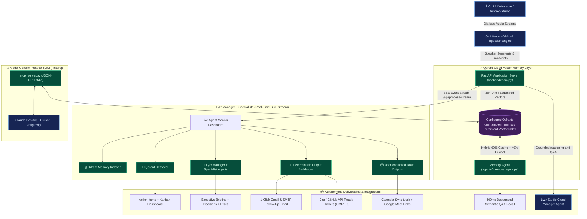

# OmiMind System Architecture

This document describes the runtime components, data flows, and architectural layers of OmiMind: Ambient Voice Memory & Autonomous Chief of Staff.

---

## Component Roles & Responsibilities

1. **Omi Voice Ingestion Layer:**
   - Exposes official webhook contracts (`POST /omi/conversation`, `POST /omi/realtime`, `POST /api/omi-webhook`).
   - Normalizes audio transcripts with speaker diarisation and fast accepted-job acknowledgement (HTTP 202 Accepted on `/api/omi-webhook`).
   - Defers vector embedding and persistence to background execution, ensuring single-pass indexing and strict `uid` isolation.

2. **Qdrant Cloud Vector Memory Layer:**
   - Collection: `omi_ambient_memory`.
   - Embeds each spoken utterance with FastEmbed `BAAI/bge-small-en-v1.5` into 384-dimensional vectors.
   - Hybrid scoring: 60% cosine similarity + 40% lexical stem overlap for dynamic relevance scores.
   - Strict `uid` filtering prevents cross-user data leakage across multi-tenant queries.
   - Privacy-first knowledge control via `POST /api/forget` and `DELETE /api/memory`.

3. **Lyzr Multi-Agent Manager Hierarchy:**
   - **Lyzr Manager (`6ac5795151dce5f00e746950`):** OmiMind Meeting Intelligence Manager acts as the root coordinator.
   - **Specialist Workers:**
     - *OmiMind Meeting Analyst* (`6ac577cccf263d0b068d001a`): Strategic decisions, risk detection, executive summary.
     - *OmiMind Action Extractor* (`6ac578bf4b079480ed4ea5a5`): Verbal commitment extraction, assignee detection, deadlines.
     - *OmiMind Recall Agent* (`6ac2646b367124ed07f49bdd`): Historical conversation recall and Q&A context.
   - **Architectural Boundary:** Python invokes ONLY the Lyzr Manager ID. It never directly invokes worker IDs.
   - **Verified Studio Trace:** 28 spans, 5 levels deep, `Agent Orchestration` span delegating dynamically to specialist agents.
   - **Verified Response Contract:** `{"response": "<string>"}` markdown content reconciled into structured briefing fields.
   - **Deterministic Fallback & Normalization:** Local Python components validate, normalize, and provide offline fallback if Lyzr Cloud is unreachable.

4. **Model Context Protocol (MCP) Server:**
   - Standard JSON-RPC 2.0 stdio server (`mcp_server.py`) exposing ambient memory tools to Claude Desktop, Cursor, and other MCP clients.
