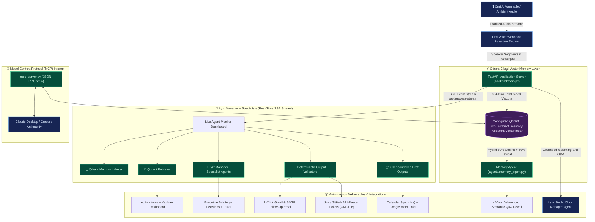

# OmiMind System Architecture

This document describes the runtime components, data flows, and architectural layers of OmiMind: Ambient Voice Memory & Autonomous Chief of Staff.

---

## Component Roles & Responsibilities

1. **Omi Voice Ingestion Layer:**
   - Exposes official webhook contracts (`POST /omi/conversation`, `POST /omi/realtime`, `POST /api/omi-webhook`).
   - Normalizes audio transcripts with speaker diarisation and fast accepted-job acknowledgement.

2. **Qdrant Cloud Vector Memory Layer:**
   - Collection: `omi_ambient_memory`.
   - Embeds each spoken utterance with FastEmbed `BAAI/bge-small-en-v1.5` into 384-dimensional vectors.
   - Hybrid scoring: 60% cosine similarity + 40% lexical stem overlap for dynamic relevance scores.
   - Privacy-first knowledge control via `POST /api/forget` and `DELETE /api/memory`.

3. **Lyzr Multi-Agent Reasoning Layer:**
   - Qdrant retrieval feeds a real Lyzr Manager/specialist reasoning step, followed by deterministic validators and user-controlled drafts.
   - Streams live execution events via Server-Sent Events (SSE) to the frontend dashboard.
   - `/ask` and the primary Track 1 pipeline use the shared Lyzr client for grounded context synthesis when configured.

4. **Model Context Protocol (MCP) Server:**
   - Standard JSON-RPC 2.0 stdio server (`mcp_server.py`) exposing ambient memory tools to Claude Desktop, Cursor, and other MCP clients.
