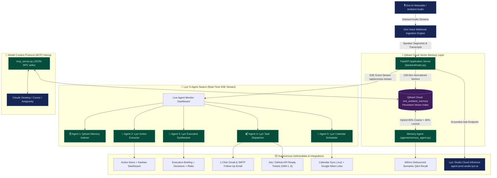

# OmiMind System Architecture

This document describes the runtime components, data flows, and architectural layers of OmiMind: Ambient Voice Memory & Autonomous Chief of Staff.

---

## Component Roles & Responsibilities

1. **Omi Voice Ingestion Layer:**
   - Exposes official webhook contracts (`POST /omi/conversation`, `POST /omi/realtime`, `POST /api/omi-webhook`).
   - Normalizes audio transcripts with speaker diarisation and sub-50ms acknowledgement.

2. **Qdrant Cloud Vector Memory Layer:**
   - Collection: `omi_ambient_memory`.
   - Embeds each spoken utterance into 128-dimensional L2-normalized dense vectors.
   - Hybrid scoring: 60% cosine similarity + 40% lexical stem overlap for dynamic relevance scores.
   - Privacy-first knowledge control via `POST /api/forget` and `DELETE /api/memory`.

3. **Lyzr Multi-Agent Reasoning Layer:**
   - 5 specialized agents execute in sequence, orchestrated by `OmiMindOrchestrator`.
   - Streams live execution events via Server-Sent Events (SSE) to the frontend dashboard.
   - `/ask` endpoint connects directly to Lyzr Studio Cloud (`https://agent-prod.studio.lyzr.ai/v3/inference/chat/`) for grounded context synthesis.

4. **Model Context Protocol (MCP) Server:**
   - Standard JSON-RPC 2.0 stdio server (`mcp_server.py`) exposing ambient memory tools to Claude Desktop, Cursor, and other MCP clients.
