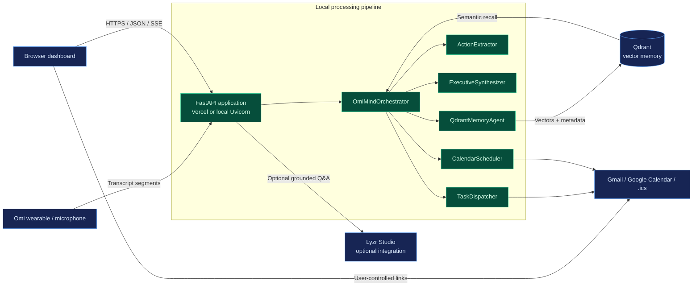

# OmiMind Architecture

This diagram shows the major runtime components and their responsibilities.

The preset demo and custom voice pipeline run locally through the five processing stages. Lyzr Studio is used only when configured for the protected `/ask` endpoint.
