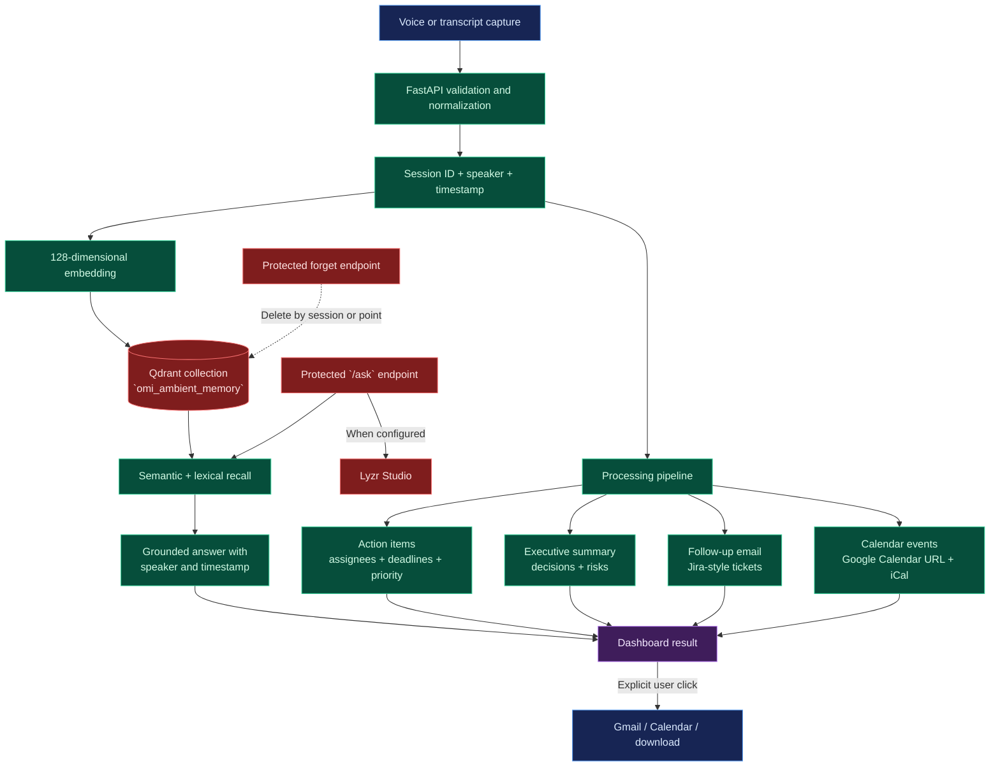

# OmiMind Data Flow

This diagram follows data from capture through storage, processing, retrieval, and user-controlled delivery.

Transcript data is sensitive. Configure `API_SECRET_KEY`, restrict `ALLOWED_ORIGINS`, and provide Lyzr credentials only when external grounded synthesis is intended.
