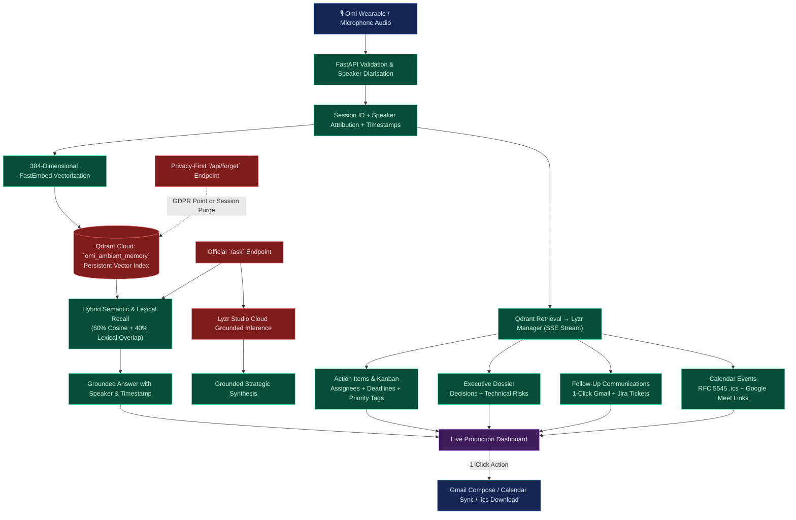

# OmiMind Data Flow

This document details the data lifecycle from voice capture through vectorization, multi-agent reasoning, retrieval, and autonomous delivery.

---

## Security & Privacy Lifecycle

- **Authentication:** Protected API endpoints are secured via `API_SECRET_KEY` header (`x-api-key` or `Bearer`).
- **Network Isolation:** CORS is strictly restricted to trusted origins via `ALLOWED_ORIGINS`.
- **Privacy-First Memory Purge:** Users retain full sovereignty over their ambient memory; `POST /api/forget` and `DELETE /api/memory` permanently delete vectors by session or point ID from Qdrant Cloud.
