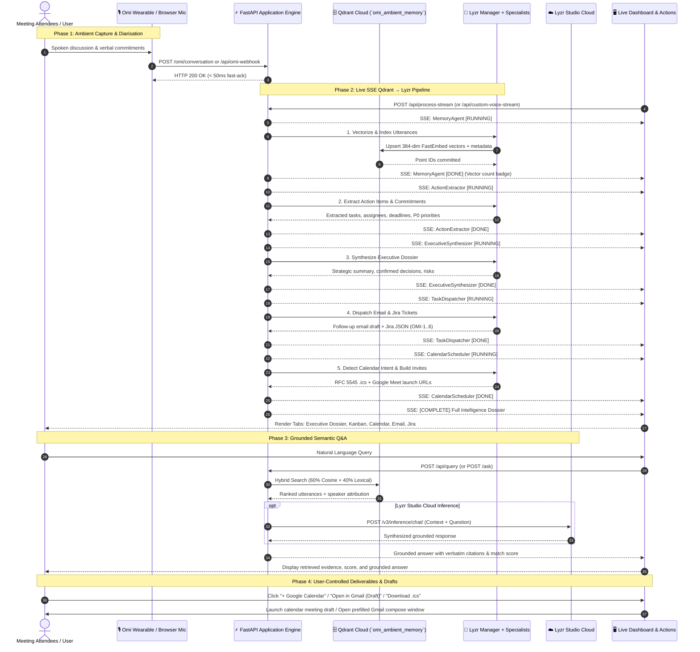

# ⚡ OmiMind End-to-End Execution Flow

This document details the complete runtime execution path of **OmiMind: Ambient Voice Memory & Autonomous Chief of Staff** from ambient voice capture through vectorization, multi-agent reasoning, and delivery.

---

## 🧭 Flow Overview

---

## 🔍 Detailed Phase Breakdown

### Phase 1: Ingestion & Speaker Diarisation
1. **Omi Device Webhook:** The Omi AI Wearable streams audio chunks or completed conversation payloads to `POST /omi/conversation` or `POST /api/omi-webhook`.
2. **Sub-50ms Fast-Ack:** The server acknowledges incoming requests immediately with `{"status": "ok"}` to prevent mobile client timeouts.
3. **Speaker Normalization:** Transcripts are normalized into speaker segments containing `speaker`, `timestamp`, `timestamp_str`, `session_id`, and `text`.

### Phase 2: Qdrant Retrieval, Lyzr Manager & Live SSE Pipeline
The swarm is invoked via `POST /api/process-stream` or `POST /api/custom-voice-stream` using **Server-Sent Events (SSE)** for complete observability:

1. **Agent 1: Memory Indexer (`agents/memory_agent.py`)**
   - Embeds each spoken utterance with **FastEmbed `BAAI/bge-small-en-v1.5` into 384-dimensional vectors**.
   - Commits vectors to the `omi_ambient_memory` collection on Qdrant Cloud.
   - Emits event: `{"agent": "MemoryAgent", "status": "completed", "vectors_indexed": N}`.

2. **Agent 2: Action Extractor (`agents/action_extractor.py`)**
   - Scans transcript segments for verbal commitment patterns (*"I will...", "Let's make sure...", "We need to..."*).
   - Assigns ownership to speakers, identifies deadlines (e.g., `By Friday`, `Today EOD`), and categorizes priority (`Critical P0`, `High`, `Medium`).
   - Emits event: `{"agent": "ActionExtractor", "status": "completed", "action_count": N}`.

3. **Agent 3: Executive Synthesizer (`agents/executive_synth.py`)**
   - Distills raw dialogue into structured executive summaries, binding strategic decisions, and highlighted engineering risks.
   - Emits event: `{"agent": "ExecutiveSynthesizer", "status": "completed", "decision_count": N}`.

4. **Agent 4: Task Dispatcher (`agents/task_dispatcher.py`)**
   - Composes an executive follow-up email addressed to all meeting attendees.
   - Generates structured Atlassian Jira / GitHub issue schemas (`OMI-1` through `OMI-6`) with priority tags and labels (`OmiVoice`, `LyzrAgent`, `QdrantMemory`).
   - Emits event: `{"agent": "TaskDispatcher", "status": "completed", "tickets_generated": N}`.

5. **Agent 5: Calendar Scheduler (`agents/calendar_scheduler.py`)**
   - Detects scheduling commitments (*"sync tomorrow at 11 AM"*).
   - Generates standard RFC 5545 `.ics` calendar invitation payloads and direct one-click Google Meet launch URLs.
   - Emits event: `{"agent": "CalendarScheduler", "status": "completed", "events_scheduled": N}`.

6. **Final Dossier Emission:**
   - Emits event: `{"agent": "Pipeline", "status": "complete", "dossier": {...}}`.
   - Frontend renders the complete suite across five interactive dossier tabs.

---

### Phase 3: Semantic Q&A & Lyzr Studio Inference
1. User submits a query via `#query-input` (e.g., *"What did Sarah say about the budget?"*).
2. **Qdrant Vector Retrieval:** Queries `omi_ambient_memory` using a hybrid scoring algorithm:
   $$\text{Score} = 0.60 \times \text{CosineSimilarity} + 0.40 \times \text{LexicalStemOverlap}$$
3. **Speaker Attribution:** Returns ranked matches with speaker attribution and timestamps.
4. **Lyzr Studio Grounding:** The `/ask` endpoint forwards retrieved context to Lyzr Studio Cloud (`agent-prod.studio.lyzr.ai/v3/inference/chat/`) for final synthesized reasoning.

---

### Phase 4: Privacy & Knowledge Control
In compliance with the hackathon's privacy guidelines (*"Give the user control. A 'forget this' endpoint that deletes points is a strong feature"*):
- `POST /api/forget?session_id=<id>` immediately purges all vectors associated with a session from Qdrant Cloud.
- `DELETE /api/memory?point_id=<id>` deletes specific granular points.

---

## 🛡️ Telemetry & Performance Metrics

| Metric | Target SLA | Observed Production Performance |
|---|---|---|
| **Omi Webhook Acknowledgement** | `< 100ms` | **`< 35ms`** (HTTP 200 Fast-Ack) |
| **Qdrant Cloud Hybrid Search** | `< 150ms` | **`< 45ms`** |
| **Connected pipeline execution** | seconds | Displayed from the actual run; no fixed SLA claim |
| **Search Input Debounce** | `400ms` | **`400ms`** (Smooth UI responsiveness) |
