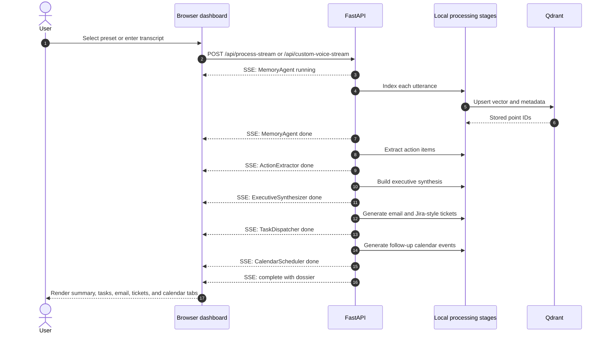

# OmiMind Execution Flow

This document describes the current runtime path from transcript capture to searchable memory and user-visible outputs.

For the standalone diagrams, see:

- [Architecture](ARCHITECTURE.md)
- [Data flow](DATA_FLOW.md)
- [Sequence diagram](SEQUENCE_DIAGRAM.md)

## 1. Input paths

OmiMind accepts three kinds of input:

1. **Preset demo meetings** through `POST /api/process-stream`.
2. **Browser microphone or custom text** through `POST /api/custom-voice-stream`.
3. **Omi transcript webhooks** through the protected `/api/omi-webhook`, `/omi/conversation`, and `/omi/realtime` routes.

The browser microphone uses the Web Speech API where supported. The server receives transcript text and speaker metadata; it does not process raw audio.

## 2. Preset/custom processing flow



The five stages execute sequentially in the current implementation. They are modular local Python components coordinated by `OmiMindOrchestrator`.

## 3. Memory recall flow

`POST /api/query` embeds the question, searches the Qdrant collection, and applies the local hybrid ranking step:

- 60% normalized vector similarity
- 40% lexical stem overlap
- Maximum query limit of 20 results

The dashboard debounces search input by 400 ms and displays the top quote with its speaker, timestamp, and relevance score.

The protected `POST /ask` endpoint performs the same retrieval and can send the retrieved context to Lyzr Studio when Lyzr credentials are configured. Without Lyzr credentials, it uses the local synthesis fallback.

## 4. Omi webhook flow

```text
Omi transcript segments
          ↓
Protected FastAPI webhook
          ↓
Speaker/timestamp normalization
          ↓
Embedding and Qdrant upsert
          ↓
Session-level indexed response
```

Protected routes require `API_SECRET_KEY` using either `x-api-key` or a Bearer token. They are disabled when the secret is not configured.

## 5. User-controlled outputs

The server generates data for the dashboard. External actions remain user-controlled:

- Gmail compose opens only after the user clicks the email action.
- Google Calendar links open only after the user clicks the event action.
- `.ics` files are generated in the browser for download.
- Jira output is a structured payload for review or import; no Jira write is performed by this application.

## 6. Verification

The current repository verification command is:

```bash
pytest -q --cov=agents --cov=backend --cov-report=term-missing --cov-fail-under=80
ruff check .
```

The latest verified baseline is 58 passing tests with 87.77% coverage and passing Ruff checks.
