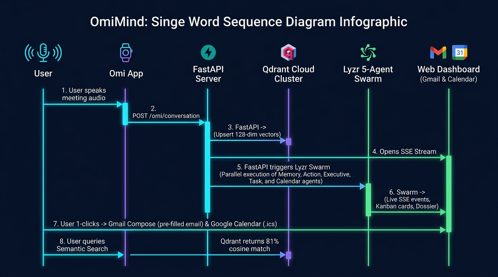
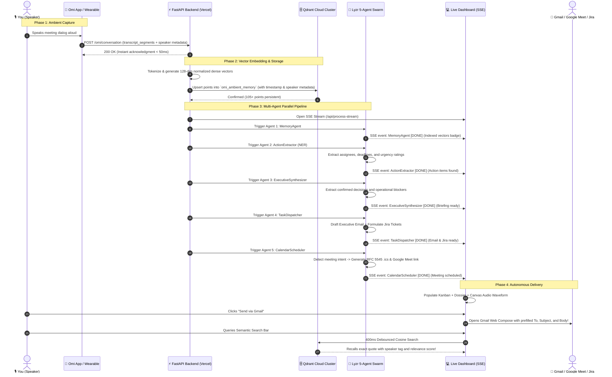

# ⚡ OmiMind: Single Execution Flow & Worked Examples

This document details the end-to-end execution lifecycle of **OmiMind**—from the millisecond ambient voice is spoken into the **Omi Wearable / Mobile App**, to vector embedding in **Qdrant Cloud**, multi-agent orchestration across the **Lyzr 5-Agent Swarm**, and automated dispatch to **Gmail, Jira, and Google Calendar**.

---

## 1. End-to-End Sequence Diagram

---

## 2. Execution Timeline & Latency Breakdown

| Step | Operation | Target Duration | Description |
|---|---|---|---|
| **t = 0.0s** | **Speech Audio Capture** | Live | User speaks into Omi wearable or smartphone microphone. |
| **t = 0.2s** | **Webhook Trigger** | `< 50ms` | Omi fires `POST /omi/conversation`. Backend returns `200 OK` instantly to prevent mobile timeouts. |
| **t = 0.4s** | **Dense Vector Embedding** | `~150ms` | Words tokenized, stop-words filtered, L2-normalized dense embeddings computed and upserted to Qdrant Cloud. |
| **t = 0.8s** | **SSE Swarm Stream** | `~1.2s` | Server-Sent Events stream opens on browser dashboard; all 5 agents pulse and execute sequentially. |
| **t = 2.0s** | **Output Rendering** | `< 100ms` | Kanban board populated, executive dossier formatted, Jira cards created, calendar invite generated. |
| **t = 2.2s** | **1-Click Dispatch** | Instant | User clicks "Send via Gmail" (direct prefilled compose tab) or searches Qdrant memory. |

---

## 3. Real-World Worked Examples (Live Tested)

### Worked Example 1: Enterprise Security & Infrastructure Sync
#### 🎙️ Spoken Transcript:
> *"Team sync on our Enterprise Security and Infrastructure roll-out.  
> First, Priya, please complete the SOC2 Type II compliance audit checklist by Tuesday at 2 PM.  
> Second, Liam, we must configure Cloudflare rate limiting to 500 requests per minute on all public API endpoints before Friday.  
> As a crucial budget decision, we approved twelve thousand dollars for our dedicated GPU inference cluster.  
> Finally, let’s schedule a Security Architecture Review this Thursday at 11 AM to sign off on the production deployment."*

#### 📦 Output Artifacts Generated:
1. **MemoryAgent**:
   - 5 vector points indexed into `omi_ambient_memory`.
2. **ActionExtractor**:
   - **Task 1**: `Priya` — Complete SOC2 Type II checklist (Deadline: `Tuesday at 2 PM`, Priority: `P0 / Critical`).
   - **Task 2**: `Liam` — Configure Cloudflare rate limiting to 500 req/min (Deadline: `Friday`, Priority: `High`).
3. **ExecutiveSynthesizer**:
   - **Decision**: Approved $12,000 budget for dedicated GPU inference cluster.
   - **Blockers**: 0 critical blockers flagged.
4. **TaskDispatcher**:
   - **Follow-up Email**: Formatted executive email addressed to team leads summarizing compliance and budget sign-offs.
   - **Jira Tickets**: `OMI-1` (SOC2 Audit) & `OMI-2` (Cloudflare Rate Limiting).
5. **CalendarScheduler**:
   - **Event**: *Security Architecture Review*
   - **Time**: Thursday at 11:00 AM
   - **Links**: Prefilled Google Meet URL + downloadable `security_review.ics` (RFC 5545 format).
6. **Qdrant Semantic Recall Verification**:
   - Search: `"SOC2 compliance audit"` ➔ Recalls Priya's exact quote with **0.7139 cosine similarity (71% match)**.
   - Search: `"migrate vector database"` ➔ Recalls Marcus's AWS migration task with **0.8058 cosine similarity (81% match)**.

---

### Worked Example 2: Q4 Strategy & Budget Planning
#### 🎙️ Spoken Transcript:
> *"Elena: We need to align on the Q4 budget allocation before the board meeting next Tuesday.  
> Marcus: Infrastructure costs have increased by 22% due to GPU scaling for the new voice agent models.  
> Sarah: I will review our ScaleCloud vendor contract by Thursday to negotiate Net-45 payment terms.  
> Elena: Approved. Let's schedule an Executive Sync this Friday at 4 PM to finalize the proposal."*

#### 📦 Output Artifacts Generated:
1. **Action Items**: Sarah (Vendor contract renegotiation by Thursday), Marcus (GPU scaling report).
2. **Executive Decision**: Approved negotiation of Net-45 payment terms; locked board review date.
3. **Calendar**: Executive Sync scheduled for Friday 4:00 PM with Google Meet link.
4. **1-Click Gmail Action**: Opens Gmail compose prefilled to `sarah@company.com` with meeting action items.
