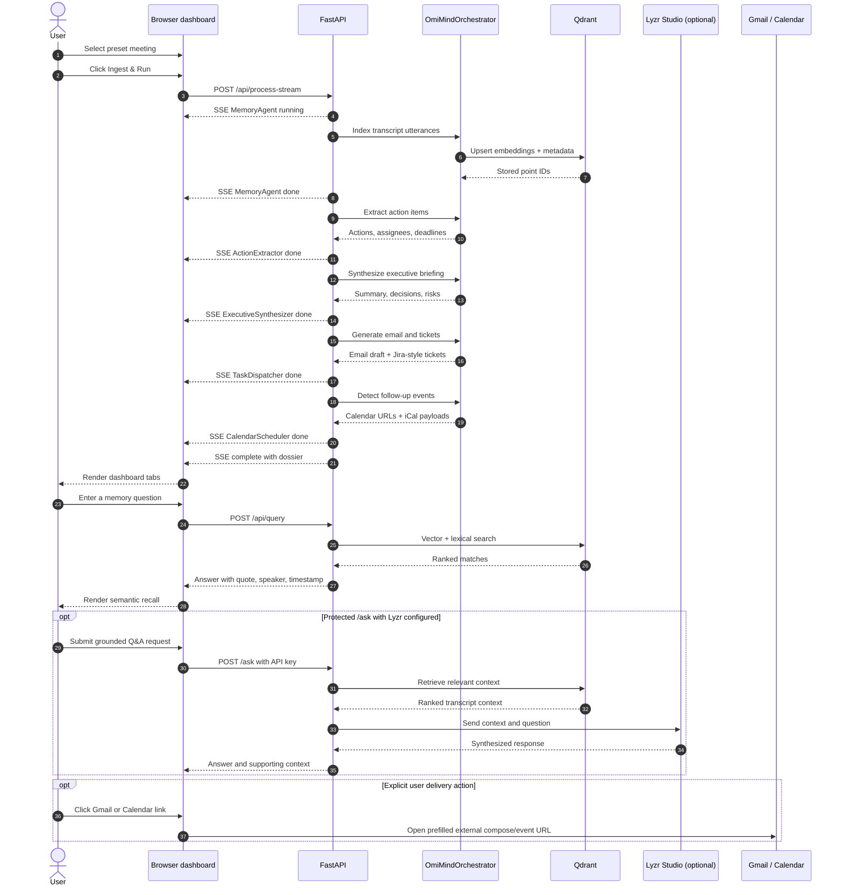

# OmiMind End-to-End Sequence

This sequence covers a preset meeting run, live SSE updates, semantic recall, and optional external Q&A.

```mermaid
sequenceDiagram
    autonumber
    actor User
    participant UI as Browser dashboard
    participant API as FastAPI
    participant Orch as OmiMindOrchestrator
    participant Q as Qdrant
    participant L as Lyzr Studio (optional)
    participant Ext as Gmail / Calendar

    User->>UI: Select preset meeting
    User->>UI: Click Ingest & Run
    UI->>API: POST /api/process-stream
    API-->>UI: SSE MemoryAgent running
    API->>Orch: Index transcript utterances
    Orch->>Q: Upsert embeddings + metadata
    Q-->>Orch: Stored point IDs
    API-->>UI: SSE MemoryAgent done

    API->>Orch: Extract action items
    Orch-->>API: Actions, assignees, deadlines
    API-->>UI: SSE ActionExtractor done

    API->>Orch: Synthesize executive briefing
    Orch-->>API: Summary, decisions, risks
    API-->>UI: SSE ExecutiveSynthesizer done

    API->>Orch: Generate email and tickets
    Orch-->>API: Email draft + Jira-style tickets
    API-->>UI: SSE TaskDispatcher done

    API->>Orch: Detect follow-up events
    Orch-->>API: Calendar URLs + iCal payloads
    API-->>UI: SSE CalendarScheduler done
    API-->>UI: SSE complete with dossier
    UI-->>User: Render dashboard tabs

    User->>UI: Enter a memory question
    UI->>API: POST /api/query
    API->>Q: Vector + lexical search
    Q-->>API: Ranked matches
    API-->>UI: Answer with quote, speaker, timestamp
    UI-->>User: Render semantic recall

    opt Protected /ask with Lyzr configured
        User->>UI: Submit grounded Q&A request
        UI->>API: POST /ask with API key
        API->>Q: Retrieve relevant context
        Q-->>API: Ranked transcript context
        API->>L: Send context and question
        L-->>API: Synthesized response
        API-->>UI: Answer and supporting context
    end

    opt Explicit user delivery action
        User->>UI: Click Gmail or Calendar link
        UI->>Ext: Open prefilled external compose/event URL
    end
```
