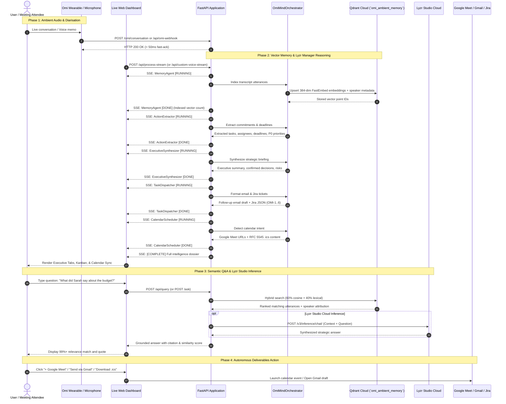

# OmiMind End-to-End Sequence Diagram

This sequence details chronological interactions across the Omi wearable, FastAPI ingestion, Qdrant vector memory, Lyzr Manager reasoning (with live SSE updates), and deterministic user-controlled outputs.

